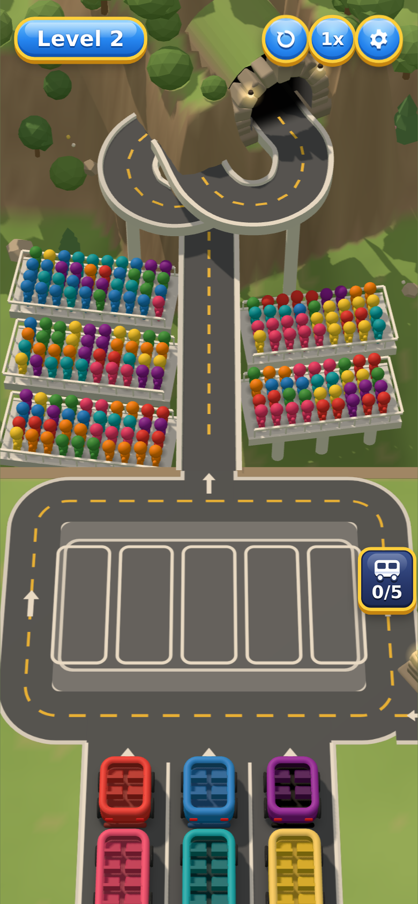
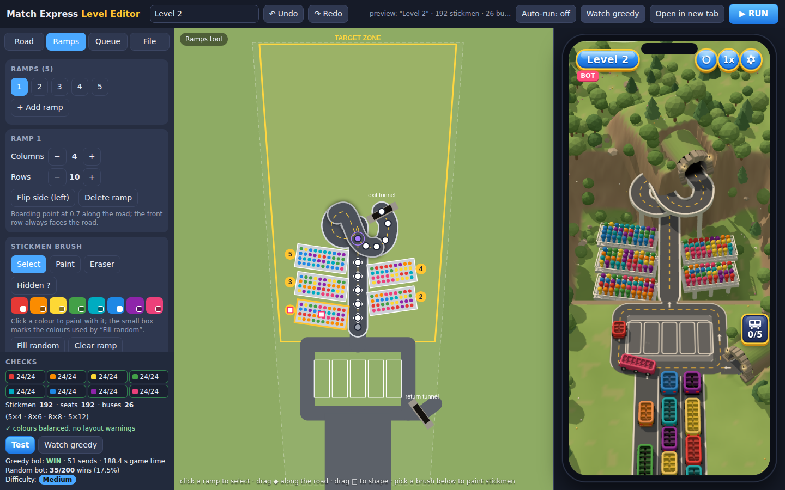

# Match Express — playable prototype + level editor

- **`index.html`** — the game. three.js 0.160.0 from a pinned CDN through an import map;
  no other libraries, no build step. Portrait 9:19.5, scales to fit, mouse and touch.
- **`editor.html`** — the level editor, with the real game running live beside it.
- **`shared/core.js`** — the rules, the level format, validation, the layout builder
  (road, ramps, tunnels, pillars), the bots and the difficulty test. Plain script, no
  three.js; the game, the editor, the Web Worker and the Node tests all load this file.
- **`shared/sync.js`** — level storage (`localStorage`) and the `BroadcastChannel`
  `"match-express-levels"` that keeps the editor and every open game tab in step.



## Look and proportions: one fixed screen layout

Every level uses the **same screen layout, zones and camera** (`SCREEN` and `SCREEN_CAM`
in `shared/core.js`). The camera never moves per level. On a 390 × 844 screen (fractions
of the height):

| zone | from – to | what is in it |
|---|---|---|
| top bar | 0 – 7% | level name, restart, speed, settings |
| **target zone** | 7 – 61% | road, spiral, ramps and exit tunnel of every level |
| static row | 61 – 77% | entry road, the five bays and the collector road |
| queue | 77 – 100% | the three queue lanes |

You asked for 62% and 72%. The static row and queue boundary moved to 77% so the
queue shows three 8-seat buses per lane; the zones are the same for every level.
- **Camera:** pitched at 52° and chosen so the largest bundled level, Crowded Rush
  Curve, fills the target zone. Stickmen are about 17.4 px tall.
- **Drawn yard:** the yard and queue are *drawn* smaller than the simulation lays them
  out. `C.dispPoint` / `C.dispScale` map a simulated position to where it is drawn;
  the simulation itself is unchanged. In detail:
  - the bays, the yard roads and the parked buses are drawn at 0.8 (bays 20% smaller);
  - the margin between the collector road and the queue is squeezed, and the
    collector has no curb strip on the queue side;
  - in each lane only the front bus is full size; the buses behind it are drawn at 0.85
    with tighter gaps, and they grow smoothly as they reach the front;
  - buses shrink smoothly as they enter the yard and grow as they leave it;
  - the return tunnel still picks its side by itself, inside the drawn yard.
- **Queue:** with every lane full of 8-seat buses, 3 per lane are fully visible
  (4 four-seat buses, 2 twelve-seat ones), checked by `tests/layout.test.js`.
- **Bus sizes:** an 8-seat bus is about 55 px long at the front of the queue and about
  41 px in a bay.

The level checker reports anything outside the target zone (`zone-road`, `zone-ramp`,
`zone-exit`, with positions). The editor draws the zone as a yellow frame.

The yard and queue are not part of the level: the editor has no setting for them.
`"yard": "classic"` is kept only so `tests/fixtures/level2-classic.json` (the original
wide layout) still replays bit for bit against the pre-editor baseline (see
Verification). It is drawn through the same fixed layout and does not fit the
target zone.

### Bundled levels

| id | name | file |
|---|---|---|
| (built in) | Level 2 | `LEVEL_DATA` in `shared/core.js` |
| `crowded-rush` | Crowded Rush | `levels/crowded-rush.json` |
| `crowded-rush-curve` | Crowded Rush Curve | `levels/crowded-rush-curve.json` |

- **Opening one:** use the game's settings menu (*Play Level 2 / Play Crowded Rush /
  Play Crowded Rush Curve*) or `index.html?level=<id>`. The editor seeds a slot for
  each.
- **Changing one:** after editing a file in `levels/`, run `node tools/sync-presets.js`
  to copy it into the core. The game and editor run from `file://` and cannot fetch
  JSON.
- **Fit:** all three fit the target zone without any change to their road or ramps.
- **Bots** (unchanged before and after this layout work; the simulation did not
  change):

| level | greedy bot | random bots | difficulty |
|---|---|---|---|
| Level 2 | win, 51 sends, 188 s | 35/200 | Medium |
| Crowded Rush | win, 74 sends, 263 s | 9/200 | Very Hard |
| Crowded Rush Curve | win, 74 sends, 263 s | 6/200 | Very Hard |

Screenshots (390 × 844):
- [Level 2](screenshots/level-2-390.png);
- [Crowded Rush](screenshots/crowded-rush-390.png);
- [Crowded Rush Curve](screenshots/crowded-rush-curve-390.png), and
  [while playing](screenshots/crowded-rush-curve-playing-390.png);
- [all of them with the zone lines](screenshots/fixed-layout-zones.png).

### Crowded Rush (bundled level)

`levels/crowded-rush.json` is laid out after the mockup. Its stickmen and buses are
unchanged from the original file; only the road and ramps moved.
- **Road:** it leaves the yard straight up and loops once in the middle of the screen.
  Then it makes an S-curve up to the exit tunnel at the top centre.
- **Ramps:** four 6 × 15 platforms run diagonally outward and up at 35°. In order:
  lower right, middle left (below the loop), upper right (above it) and top left.
  The level has no layout warnings.
- **Opening it:**
  - the editor seeds it as the slot "Crowded Rush";
  - the game opens it with `index.html?level=crowded-rush`.
- [Side by side with the mockup](screenshots/crowded-rush-vs-mockup.png) (taken before the fixed layout).
- **Bots:** the greedy bot wins in 74 sends (263 s). Random bots win 9/200, which is
  *Very Hard*.

Screenshots (390 × 844):
- [the full game at the start](screenshot-390.png);
- [a bus stopped at a ramp with its stickmen cheering](screenshots/game-cheering.png),
  and [close up](screenshots/game-cheering-close.png);
- [a full bus driving off the road edge](screenshots/game-exit.png), and
  [close up](screenshots/game-exit-close.png);
- [the parachute](screenshots/game-parachute.png);
- [a bus fading into the exit tunnel](screenshots/game-tunnel-close.png), close up.

## Opening the editor next to the game

Serve the folder and open the editor (a plain `file://` open works too, but browsers
limit `BroadcastChannel` and `localStorage` between `file://` pages):

```
cd match-express
python3 -m http.server 8000
# open http://localhost:8000/editor.html
```



- **Left:** tool tabs (Road, Ramps, Queue, File) and the **Checks** panel, which is
  always visible.
- **Centre:** a top-down view you edit with mouse or touch. The dashed trapezoid is
  what the game camera sees. Wheel zooms, dragging empty space pans.
- **Right:** the real `index.html` in a 390×844 phone frame. **Open in new tab**
  opens the game full size. That tab follows the editor through the channel, so you
  can keep it on a second screen or a phone-sized window.

**RUN** saves the level and restarts it fresh, in the preview and in every open game
tab. **Auto-run** does the same thing by itself 500 ms after each edit (the timer
restarts on every change, so a drag only restarts once you let go). When the game
starts, it loads the first level it finds from this list:
1. a level the editor sends;
2. the last level saved in `localStorage`;
3. the built-in `LEVEL_DATA`.

Settings → *Built-in level* clears the saved level. `index.html?builtin` ignores it
for one load.

### Road
- Drag a control point to move it. Click the road to insert a point there.
- Right-click (or long-press on touch) deletes a point.
- **Spiral** (selected point) turns the point into a loop that crosses over itself,
  with an overpass and pillars. You can set its radius and side.
- These parts are placed automatically:
  - the road start, at the entry road;
  - the exit tunnel, at the road end along the last tangent;
  - the return tunnel, at the collector end on the side nearer the exit tunnel,
    facing the bays;
  - the pillars, evenly spaced.
- Warnings in Checks, also circled in red:
  - the road crosses itself outside a spiral;
  - a point is off screen;
  - a curve is too tight for a 12-seat bus.

### Ramps
- Add or delete ramps. A new or flipped ramp is a straight platform with railings.
  It runs diagonally outward and up at 35° (`"tilt"`) and is sized to its columns
  and rows. Drag its shape points to bend it into a spline.
- The boarding point (diamond) snaps to the road and can be dragged along it. The
  front row always faces the road.
- Columns and rows have +/− buttons.
- To place stickmen:
  - paint with the 8-colour palette;
  - use the **eraser** to empty a cell;
  - **Fill random** fills runs of 1–4 per column from the colours you picked;
  - the **hidden** brush shows a stickman as "?" until it reaches the front row.
- Warnings: a ramp overlaps another ramp or the road; a boarding point sits on a
  spiral overpass.

### Queue
- The queue has three lane lists. Add a bus with a colour and a capacity (4/6/8/12).
- Toggle **hidden**, drag to reorder within a lane or between lanes, or delete.
- Select two or more buses and **Link** them. Tapping one linked bus sends the whole
  group. That works only when every bus in the group is at the front of its lane and
  there is room for all of them (road slots plus free bays). Otherwise the tap is
  refused.

### Checks
Checks shows:
- stickmen against seats for each colour, green when they match and red when they
  don't;
- totals and the number of buses of each size;
- every layout warning.

**Test** runs the greedy bot plus 200 random games in a background worker. It
reports:
- whether the greedy bot wins or fails;
- how many sends it took and the game time;
- the random bot's win rate;
- a difficulty label: Easy >45%, Medium 15–45%, Hard 5–15%, Very Hard <5%.

**Watch greedy** plays the greedy bot in the preview.

### File: slots, export, import, undo
- **Slots:** save, load, rename, duplicate and delete named levels, all stored in
  `localStorage`.
- **Export** copies the level JSON to the clipboard and downloads it as `.json`.
- **Import** reads pasted JSON or a file. It accepts format 2 levels and old format 1
  levels (format 1 gets the default layout).
- **Undo / redo:** Ctrl+Z / Ctrl+Shift+Z (or Ctrl+Y) work for every edit.

The editor also keeps an autosaved draft, so a reload doesn't lose work.

Level format 2:

```js
{ format: 2, name, seed,
  road:  { points: [{x, z, spiral?: {r, side}}], tail? },
  ramps: [{ cp | at, side, tilt?, shape?: [[x, z], ...], rows, columns: [["red", "?blue", null, ...], ...] }],
  lanes: [[{ color, cap, hidden?, link? }, ...], [...], [...]] }
```

`tilt` (degrees) makes a straight platform leaving the road at that screen angle,
outward and up. Without `tilt` or `shape` a ramp gets the original curved default.
In `columns`, each list is one column, front cell first. `"?colour"` is a hidden
stickman and `null` is an empty cell. Each lane lists its front bus first.

## Single-file versions (double-click, no server)

```
node tools/build-standalone.js
```

This writes four files to `dist/`. Each one works when you open it straight from disk:
- **`match-express-game.html`** is the game with `shared/core.js` and
  `shared/sync.js` inlined.
- **`match-express-editor.html`** is the editor with everything inlined. The game
  preview is embedded through `iframe srcdoc`, so it needs no second file. RUN and
  Auto-run work as usual. *Open in new tab* opens the same embedded game in a new
  tab. That tab gets every later RUN through `window.opener`.
- **`match-express-play.html`** and **`match-express-crowded-rush-curve.html`** are
  share files. They open with Level 2 and with Crowded Rush Curve.
  - Neither loads a saved (or sent) editor level, and neither runs the background bot
    test.
  - Their settings menu plays each bundled level.

Both still load three.js from the pinned CDN, so they need an internet connection.
Opened from disk, a separately opened game file may not sync with the editor, because
browsers isolate `file://` pages.

## Speed, sound, animation

- **1x / 2x** (top right, next to settings) sets one global time scale for the
  simulation, the animations, the particles and the timers. "2x" is highlighted when
  it is on. Sounds keep their pitch. The headless bots and the tests always run at
  1x.
- **Sound** is synthesised with WebAudio:
  - pops rise in pitch along a boarding chain and reset after it;
  - each bus has an engine hum that follows its speed;
  - also: a soft brake squeak, a horn when a bus fills, a whoosh when the parachute
    opens, an echo in the tunnel and a soft warning thud;
  - a forest ambience of wind and birds plays underneath;
  - every sound is layered and its pitch varies a little.

  Settings → *Sound* mutes it, and the choice is remembered.
- **Buses** are chunky toy buses, one colour each, with lighter and darker trims of
  that colour:
  - a rounded boxy body with a darker lower band and a thick rounded rim around the
    open top;
  - small round headlights and a rounded bumper at the front, red tail lights at the
    back;
  - fat dark wheels that peek out at the sides;
  - inside, the floor, seats and inner walls are in a darker shade.

  The body is one profile swept around a rounded rectangle. The front and back caps
  stay the same size, and only the middle stretches with capacity.
- **Stickmen** are chunky toy figures with no face:
  - a big round head (40% of their 0.78 height) and a short rounded body;
  - thick rounded arms and legs, as three instanced meshes (bodies, arms, legs).

  They swing their arms and legs when they run. Seated in a bus, only the head and
  shoulders show above the seat back.
- **Tunnels** (top exit and return) are built the same way:
  - a stone arch of chunky blocks on a thick base, with two warm lamps that pulse
    when a bus passes;
  - a dark interior that fades to black, with the road running into it;
  - a grassy roof mound behind the arch.

  The arch is aligned with the road direction at the mouth. A bus fades into the dark
  front first and comes out rear last. The darkening is per pixel, behind the
  mouth: a shader patch on the road, bus, wheel and stickman materials. A bus is
  fully dark by the time the core hides it, so it never pops.
- **Animation:** nothing snaps.
  - Buses ease in and out, and sit on spring suspension.
  - They lean in curves, their wheels turn, and they pitch forward on hard brakes.
    A hard stop kicks up a little dust.
  - The queue rolls forward smoothly.
  - When a bus stops at a ramp, every stickman it will take at that stop starts
    cheering at once: the whole chain, not just the front row. They hop with their
    arms up in a V, slightly out of step. They keep cheering until their turn, then
    run and jump in. Other colours stay calm.
  - Columns step forward in a staggered wave. Idle stickmen breathe, sway and look
    around, each a little differently.
  - **A full bus first drives straight sideways**, perpendicular to the road, off
    the edge on the side away from its ramp, with a dust puff. Only when it is
    completely off the road does it crouch and hop. Under the elevated U-turn
    (ramp 5) it slides further, until no road is overhead. The parachute in its colour
    unfolds with an overshoot, and the bus swings like a pendulum while drifting
    down and away, its passengers waving with both arms.
  - The ramp check badge pops with an overshoot and a sparkle.
  - A crash plays in slow motion, then the dominoes fall and the stickmen tumble.
  - Buttons and panels spring.
- **Shading:**
  - soft contact shadows under every bus and every standing stickman;
  - ambient-occlusion darkening baked into the ground under the road and the ramps.
- **The UI** uses chunky, glossy candy controls (level pill, buttons, counter sign),
  each with a thick gold rim, a deep bottom edge and a gloss highlight.

## Playing

Tap the front bus of a queue lane. If *buses on the main road + buses heading to it +
buses returning through the tunnel* is under 5 it drives to the main road (collector
road, nearer side lane, entry road); otherwise it parks in the leftmost free bay;
with no free bay it shakes and stays (not a fail). Tap a parked bus to send it to
the main road, or it does a handbrake lurch when the road check fails.

On the main road a bus stops at a ramp only if a front-row stickman matches its
colour. Matching front-row stickmen board nearest-the-road first, the columns step
forward, and the new front row is checked again until the bus is full or nothing
matches. A full bus honks, drives sideways off the road edge, then hops and
parachutes away. An unfilled bus goes through the top tunnel, comes out of the
return tunnel `RETURN_TUNNEL_TIME` later
and parks in the leftmost free bay with its passengers. If every bay is taken when
it comes out, it crashes into the parked row (dominoes) and the level is lost.

Keys: **D** debug (front rows, boarding points, road-capacity maths), **B** greedy bot
plays live, **R** restart.

## Tuning

At the top of `shared/core.js`: `BUS_SPEED`, `BOARD_RATE`, `COLUMN_SHIFT_TIME`,
`ROAD_CAPACITY` (5), `STATIC_SLOTS` (5), `PARACHUTE_DURATION`, `RETURN_TUNNEL_TIME`,
`WIN_PANEL_DELAY` (1 s).

## Level data and the generator

`LEVEL_DATA` in `shared/core.js` is the built-in level, in format 2 (see above):
5 ramps of 4 columns and 3 lanes. The game never runs the generator. The editor is
now the usual way to make a level.

The built-in level has the stickmen and buses `generateLevel(11)` produced. Only its
road and ramp placement are the hand-made compact layout. Ramp 3's columns are back
in the generator's order, which the compact road boards in the original priority. The generator still works: run this in the
console and import the result into the editor, or paste it over `LEVEL_DATA`:

```js
MECore.searchSeed(1, 400, console.log).level
```

`generateLevel(seed)` gives 24 stickmen per colour on ramps of 40/36/40/36/40, with
runs of 1–4 in every column, at least 6 colours per ramp, at least 5 colours across
the front rows, the fixed bus plan in lanes of 9/9/8, and 2 hidden buses outside
the first two places. `searchSeed` keeps the first seed where the greedy bot wins
(at both the 1/30 s headless step and the 1/60 s live step) and the random bot wins
15–45% of 200 runs.

On startup the page re-validates `LEVEL_DATA` and logs seats against stickmen per
colour. A Web Worker then replays both bots on the frozen level:

```
[level] seed 11 — the game loads the frozen LEVEL_DATA
[level] seats vs stickmen per colour: red 24/24 ... pink 24/24 -> ALL MATCH
[sim] greedy bot: WIN — 51 sends, 192/192 boarded, 188.4 s of game time
[sim] greedy moves: L0:red4>road L0:pink12>road L0:orange6>road ...
[sim] random bot: 35/200 wins (17.5%) — difficulty Medium
```

**Bots.** Both bots tap only when the bus would go to the main road; neither ever
parks a lane bus on purpose. The **greedy bot** sends the available bus whose colour
has the most stickmen in the front rows. It waits while that score is 0 and traffic
is still moving. On a tie at 0 it takes a lane front, to dig into the queue; on a
positive tie it takes a parked bus, to free a bay. Without that tie-break it could
cycle the same parked buses forever. The **random bot** picks uniformly among the
available buses.

## How a few pieces work

**Yard traffic** never collides or deadlocks. When a bus is sent, its route is
rasterised once into the grid cells its footprint sweeps (0.3-unit cells with a
0.1 margin). Each cell stores when the bus enters it and when it leaves. A later
trip may not enter a cell that an earlier trip still has to cross. Waiting only ever
points at earlier trips, so there can be no cycle, and with merge order equal to
send order the buses also join the main road in the order they were sent. Each
check is O(1) per pair of trips per step.

**Main road.** Catmull-Rom (the same centripetal formulation as
`THREE.CatmullRomCurve3`) through the control points, with one loop. The loop
crosses its own entry 1.25 units higher, on white pillars. Buses keep a fixed bumper
gap, so a stop for boarding cascades into hard brakes behind it, with brake lights.

**Ramps** hang 0.85 below the road deck (`RAMP_DROP` in the yard preset). Passengers
hop up into the bus. A full bus driving sideways off the road passes above the
neighbouring crowds, so it never cuts through anyone. The simulation never reads ramp
height.

**Rendering.**
- **Stickmen** are three instanced meshes: bodies (torso and head), arms (2 each) and
  legs (2 each). Their shadow map comes from a low-poly proxy that shares the body
  matrices, and a soft blob under each one is a fourth instanced mesh.
- **Buses:** each is one merged vertex-coloured mesh plus its light meshes and a
  contact-shadow quad. Wheels are one instanced mesh, tinted per bus in tunnels.
- **Tunnels** sit in a trench carved into the terrain heightfield, under a roof
  shell, so nothing blocks the view into the mouth.
- **The yard paint** is one canvas texture per yard preset.

## Verification

```
node tests/rules.test.js      # 28 rule checks (unchanged)
node tests/layout.test.js     # yard clearance sweep (both yard presets) + the drawn queue: >= 3 eight-seat buses per lane on 390 x 844
node tests/shared.test.js     # 64 checks: level format, layout builder, warnings (incl. the target zone), difficulty, links, bundled levels
node tests/browser.test.js    # 59 checks: game + editor in Chromium (needs `npm i playwright`)
node tests/standalone.test.js # 16 checks: builds dist/ and opens the single files and both share files from file://
```

The first three need only Node and no dependencies; they load `shared/core.js`.
`browser.test.js` serves the folder itself. It takes these optional settings:
- `CHROMIUM=/path/to/chrome`;
- `THREE_MODULE=/path/to/three.module.js`, to serve three.js locally when offline;
- `HEADFUL=1`, to watch the run.

It ends by saving the editor screenshot.

**The rules did not change.** `tests/baseline.json` was recorded before the editor
work. The classic layout (`tests/fixtures/level2-classic.json` with
`"yard": "classic"`) still matches it bit for bit, through today's core: road length,
boarding points, the greedy bot's move list and times at 30 Hz and 60 Hz, and the
random bot's 31/200. Only geometry differs for the compact built-in level, and on it:
- the same stickmen and buses board in the same ramp order and the same column
  priority;
- the greedy bot wins at 30 Hz and 60 Hz (51 sends, 188.4 s);
- the random bot wins 35/200 (17.5%, Medium).

- The shared suite covers:
  - format 1 → 2 compatibility;
  - the tunnel side choice;
  - pillars and spirals;
  - ramp ordering and custom grids;
  - empty and hidden cells;
  - every warning kind;
  - the difficulty labels and `testLevel`;
  - linked buses.
- The browser suite covers:
  - the game's load order, 2x speed and mute;
  - RUN, Auto-run timing and new-tab sync;
  - undo/redo;
  - road insert, drag and delete, mouse and touch, and spirals;
  - painting, hidden cells, eraser and Fill random;
  - ramp resize and boarding drag;
  - queue add, link and reorder;
  - export/import and slots;
  - Test and Watch greedy;
  - proportions with the fixed camera: every stickman at least 16 px and the 8-seat
    bus in a bay at least 35 px, at 390 × 844;
  - the target zone: an out-of-zone road is listed, and a point added outside the
    frame lands inside it;
  - cheering: the cheering set equals exactly the stickmen who then board the bus,
    and is larger than the front row;
  - the full-bus exit: it moves perpendicular to the road (drift along it 0.000), on
    the side away from its ramp, without lifting. The hop starts only after the bus
    is clear of the road (clear at 1.23, hop at 1.41). A bus filled under the
    overpass hops with no road above it.

- Headless rule suite (28 checks), all passing:
  - sending destinations and refusal;
  - the counter, including an invariant checked at every step of 120 bot games;
  - merge order and no overtaking;
  - boarding order and chains, and the instant jump on the last seat;
  - tunnel timing, leftmost-bay parking and keeping passengers;
  - fail on tunnel exit, hidden reveal, and the greedy win at 60 Hz;
  - no yard overlap (separating-axis test) and no deadlock across 120 bot games.
- The layout check sweeps every yard route at the maximum bus length against parked
  and queued buses, for both presets. The minimum clearance is +0.027 for the
  compact yard and +0.030 for the classic one.
- In the browser, a live bot game:
  - wins in about 190 s of game time;
  - shows the Level Complete panel after the last parachute opens, plus
    `WIN_PANEL_DELAY`;
  - shows all 5 ramp check badges;
  - resets cleanly on Replay.
- A forced fail plays the crash, the dominoes and the Out of Space panel.

**Frame rate could not be measured here.** The sandbox has no GPU. What I could
measure:
- **132 draw calls, ~390k triangles per frame** at a busy moment, shadow pass
  included.
- 0.38 ms of CPU per 60 Hz logic tick, including the scene update.
- The canvas renders at native device resolution, capped at 2× DPR.

The 60 fps target is unverified on real hardware.

## Judgement calls

- **Environment.** The brief asks for a cozy forest on a grassy hill; the mockup is
  a red-rock canyon. I followed the brief, with muted greens so buses and stickmen
  stay the most saturated things on screen. I matched the mockup's layout, camera
  angle, UI and mood.
- **Return tunnel.** Its mouth faces left but is turned ~37° toward the camera. Fully
  side-on, the arch was invisible from this camera angle.
- **Level length.** The compact road makes the level shorter for the greedy bot:
  about 3 minutes, against 4. The random bot's 17.5% is inside the Medium band.
- **Compact layout versus a side exit.** Under the earlier closer camera (22 px
  stickmen and 70 px buses on a 390 px wide screen), the layout only fit if the ramps sit edge to edge along the road. That leaves no
  gap at the road side, so a full bus could not drive off without cutting through a
  neighbouring ramp. So the ramps hang 0.85 below the road deck: the bus drives off
  the edge above the neighbouring crowds, then hops. It always leaves on the side
  away from the ramp it boarded at.
- **How stickman height is measured** (formerly "at least 22 px", now about 17 px
  with the fixed camera). It is the on-screen silhouette of a standing
  stickman, from the feet to the top of the head. The figures are 0.78 tall on a
  0.36 grid, so crowds are packed head to head, as in the reference image.
- **Cheering** covers exactly the stickmen the stopped bus will take at this stop.
  Hidden stickmen join in only once they are revealed, so cheering never gives a
  colour away. Boarding is fast (8 per second), so a cheer lasts well under a second.
- **The classic preset** keeps the original layout playable and is the regression
  baseline for the rules. It uses the new bus and stickman models with its original
  camera.
