# Match Express — playable prototype + level editor

- **`index.html`** — the game. three.js 0.160.0 from a pinned CDN through an import map;
  no other libraries, no build step. Portrait 9:19.5, scales to fit, mouse and touch.
- **`editor.html`** — the level editor, with its own copy of the game running beside it.
- **`shared/core.js`** — the rules, the level format, validation, the layout builder
  (road, ramps, tunnels, pillars), the bots and the difficulty test. Plain script, no
  three.js; the game, the editor, the Web Worker and the Node tests all load this file.
- **`shared/sync.js`** — the editor's storage (saved levels by id, the level order,
  prefs) and the background bot worker. The game never reads the editor's storage.
- **`shared/bundle.js`** — packs the game into one self-contained HTML file (core,
  sync and three.js inlined). The editor's *Export playable HTML* and
  `tools/build-standalone.js` both use it.
- **`vendor/three.module.min.js`** — three.js r160 (MIT), the same version as the
  CDN pin, for the single-file exports that must run offline.


## Look and proportions: one fixed screen layout

Every level uses the **same screen layout, zones and camera** (`SCREEN` and `SCREEN_CAM`
in `shared/core.js`). The camera never moves per level. On a 390 × 844 screen (fractions
of the height):

| zone | from – to | what is in it |
|---|---|---|
| top bar | 0 – 7% | level name, restart, speed, settings |
| **target zone** | 7 – 61% | road, spiral, ramps and exit tunnel of every level |
| static row | 61 – 77% | entry road, the five bays and the collector road |
| queue | 77 – 100% | the three queue lanes |

You asked for 62% and 72%. The static row and queue boundary moved to 77% so the
queue shows three 8-seat buses per lane; the zones are the same for every level.
- **Camera:** pitched at 52° and chosen so the largest bundled level, Crowded Rush
  Curve, fills the target zone. Stickmen are about 17.4 px tall.
- **Drawn yard:** the yard and queue are *drawn* in a slightly squeezed form of the
  simulation's layout. `C.dispPoint` / `C.dispScale` map a simulated position to where
  it is drawn; the simulation itself is unchanged. In detail:
  - every bus is drawn at **road size** from the front of its queue lane, through the
    yard, onto the road and in the bays, so a sent bus never shrinks;
  - the bay row is drawn at road size, so a 12-seat bus fits its bay (2.56 long in a
    2.82 bay); to keep the screen zones, only the strips above the bays (entry) and
    below them (collector) are squeezed vertically, to 0.6;
  - the margin between the collector road and the queue is squeezed, and the
    collector has no curb strip on the queue side;
  - in each lane the **front bus** is road size and 10% larger than the buses behind
    it (drawn at 1/1.1 with tighter gaps); they grow smoothly as they reach the front;
  - the front bus of each lane has a soft white outline with a glow, showing it can
    be tapped; the buses behind it have none;
  - the return tunnel still picks its side by itself, inside the drawn yard.
- **Queue:** with every lane full of 8-seat buses, 3 per lane are fully visible
  (4 four-seat buses, 2 twelve-seat ones), checked by `tests/layout.test.js`.
- **Bus sizes:** an 8-seat bus is about 51 px long at the front of the queue, on the
  road and in a bay.

The level checker reports anything outside the target zone (`zone-road`, `zone-ramp`,
`zone-exit`, with positions). The editor draws the zone as a yellow frame.

The yard and queue are not part of the level: the editor has no setting for them.
`"yard": "classic"` is kept only so `tests/fixtures/level2-classic.json` (the original
wide layout) still replays bit for bit against the pre-editor baseline (see
Verification). It is drawn through the same fixed layout and does not fit the
target zone.

### Bundled levels

| id | name | file |
|---|---|---|
| (built in) | Level 2 | `LEVEL_DATA` in `shared/core.js` |
| `crowded-rush` | Crowded Rush | `levels/crowded-rush.json` |
| `crowded-rush-curve` | Crowded Rush Curve | `levels/crowded-rush-curve.json` |

- **Opening one:** use the game's settings menu (*Play Level 2 / Play Crowded Rush /
  Play Crowded Rush Curve*) or `index.html?level=<id>`. The editor seeds a slot for
  each.
- **Changing one:** after editing a file in `levels/`, run `node tools/sync-presets.js`
  to copy it into the core. The game and editor run from `file://` and cannot fetch
  JSON.
- **Fit:** all three fit the target zone without any change to their road or ramps.
- **Bots.** The results are identical before and after the fixed-layout work and
  before and after the road-only sending rule. The bots never parked a queue bus
  (see *Bots* below), so the new rule does not change what they can do:

| level | greedy bot | random bots | difficulty |
|---|---|---|---|
| Level 2 | win, 51 sends, 188 s | 35/200 | Medium |
| Crowded Rush | win, 74 sends, 263 s | 9/200 | Very Hard |
| Crowded Rush Curve | win, 74 sends, 263 s | 6/200 | Very Hard |

Screenshots (390 × 844):
- [Level 2](screenshots/level-2-390.png);
- [Crowded Rush](screenshots/crowded-rush-390.png);
- [Crowded Rush Curve](screenshots/crowded-rush-curve-390.png), and
  [while playing](screenshots/crowded-rush-curve-playing-390.png);
- [all of them with the zone lines](screenshots/fixed-layout-zones.png).

### Crowded Rush (bundled level)

`levels/crowded-rush.json` is laid out after the mockup. Its stickmen and buses are
unchanged from the original file; only the road and ramps moved.
- **Road:** it leaves the yard straight up and loops once in the middle of the screen.
  Then it makes an S-curve up to the exit tunnel at the top centre.
- **Ramps:** four 6 × 15 platforms run diagonally outward and up at 35°. In order:
  lower right, middle left (below the loop), upper right (above it) and top left.
  The level has no layout warnings.
- **Opening it:**
  - the editor seeds it as the slot "Crowded Rush";
  - the game opens it with `index.html?level=crowded-rush`.
- [Side by side with the mockup](screenshots/crowded-rush-vs-mockup.png) (taken before the fixed layout).
- **Bots:** the greedy bot wins in 74 sends (263 s). Random bots win 9/200, which is
  *Very Hard*.

Screenshots (390 × 844):
- [the full game at the start](screenshot-390.png);
- [a bus stopped at a ramp with its stickmen cheering](screenshots/game-cheering.png),
  and [close up](screenshots/game-cheering-close.png);
- [a full bus driving off the road edge](screenshots/game-exit.png), and
  [close up](screenshots/game-exit-close.png);
- [the parachute](screenshots/game-parachute.png);
- [a bus fading into the exit tunnel](screenshots/game-tunnel-close.png), close up.

## The editor

Serve the folder and open the editor. A plain `file://` open of `editor.html` works
for editing, but its preview and exports need the game files, so for that use a server
or the single-file `dist/match-express-editor.html`:

```
cd match-express
python3 -m http.server 8000
# open http://localhost:8000/editor.html
```


- **Top toolbar:**
  - *File* (new, open: Levels & level order, save, save as, duplicate, import);
  - undo / redo;
  - the level's **id** and name, and whether it is saved (an orange dot and a ● in the
    tab title mark unsaved changes; every edit is also kept as a draft, so a reload
    picks up where you left off);
  - *Run*, *Auto*, *Watch*, *Test*;
  - *Export*;
  - show / hide the preview;
  - help.
- **Left tool panel:**
  - select / move, road points, add ramp;
  - paint, eraser, hidden-stickmen brush, with the 8 colours;
  - the ramp blockers: colourful tunnel, lock box, count box;
  - connect buses, plus the size for new buses.
- **Centre:** a top-down view you edit with the mouse or touch. The yellow frame is the
  target zone. Wheel (or a trackpad / touch pinch) zooms; Space-drag or the middle mouse
  button pans; *F* fits. Dragging over empty space draws a selection box. Whatever is
  under the pointer is highlighted, and the selection is outlined in yellow.
  Problems are circled in red with a short note next to them.
- **Queue pane:** 2 to 5 lanes (the − / + stepper), front at the top, drawn as buses
  whose length shows their size. The pane widens for 4 and 5 lanes.
- **Level card** (nothing selected): id, name, **role** (Tutorial, Teach, Practice,
  Challenge, Milestone, Relax, Fun, Finale…), **target difficulty** (1–10), queue lanes.
  Role and difficulty are design notes kept in the level's `meta`.
- **Right:** the **inspector** for the selection (level, road point(s), exit tunnel,
  ramp(s), tunnel(s), box(es), stickman cells, one bus or several). A problem with the
  selected thing is shown at the top of its card. Below: the **Checks**.
- **Far right:** the preview, the real game in a 390×844 phone frame.
- With no ramps the view says so, with an *Add ramp* button; an empty queue says
  "No buses yet – Add bus"; an empty lane has its own *+ Add*.

Every icon and menu entry has a tooltip or label with its shortcut. **?** opens the list.
**Right-click** anything (a point, the exit tunnel, a ramp, a blocker, stickman cells, a
bus, an empty lane, the ground) for a menu with the same actions.

Shortcuts use **Cmd** on a Mac and **Ctrl** elsewhere (both are accepted everywhere);
they replace the browser's own (Ctrl+S does not save the web page, Ctrl+D does not
bookmark it). Some browsers keep Ctrl+N / Ctrl+W for themselves in a normal tab; *File →
New level* always works.

| key | action | key | action |
|---|---|---|---|
| 1 … 9, 0 | tools: select, road, ramp, paint, eraser, hide, tunnel, lock, count, connect | Ctrl S | save |
| V P R B E H T K N | the same tools by letter | Ctrl Shift S | save as a new level |
| Shift 1 … 8 | pick a colour | Ctrl N | new level |
| L | connect the selected buses | Ctrl O | open (Levels & level order) |
| Ctrl Z | undo | Ctrl E / Ctrl Shift E | export level JSON / playable HTML |
| Ctrl Shift Z, Ctrl Y | redo | Ctrl Enter | run the preview |
| Ctrl C / X / V | copy / cut / paste | Ctrl D | duplicate |
| Del / Backspace | delete the selection | Ctrl A | select all of the current tool's things |
| Shift- / Ctrl-click | add to / remove from the selection | drag on empty space | box select |
| arrows | nudge (Shift: further) | Esc | deselect / close |
| Space-drag, middle mouse | pan | wheel, pinch | zoom |
| F | fit the view | ? | help |

What the selection commands work on:
- **Road points** (road tool, or click / box): copy-paste inserts the copies after the
  selection; arrows move them 0.1 (Shift 0.5); the first point stays fixed to the yard.
- **Ramps** (select tool): pasted copies board further along the road; arrows slide a
  ramp along the road (a loose one moves freely).
- **Tunnels and boxes** (their tools): pasted into the selected ramp, in a free column;
  arrows move them a cell.
- **Stickman cells:** drag a box over a ramp (select tool), or *Ctrl A* with a stickmen
  tool for a whole ramp; paste goes to the hovered cell or the selected ramp's first
  cell; arrows move them a cell; *Delete* empties them; their card paints or hides them.
- **Buses:** paste inserts after the selected bus; arrows up / down reorder, left / right
  move to the neighbouring lane.
- **The level:** with nothing selected, *Ctrl C* copies the whole level and *Ctrl D*
  duplicates it into the saved levels; in the Levels list the arrows pick a level,
  *Enter* opens it, *Ctrl D* duplicates it and *Del* deletes it. A level JSON on the
  system clipboard pastes in as a new saved level.
- Undo and redo bring back the selection with the level.

### The game, the preview and exports are independent
- The editor's changes never reach the game page or an exported file. `index.html`
  opens its built-in level (or `?level=<id>`, a bundled level). It never loads a level
  saved in the editor, and there is no channel between the editor and game tabs.
- The **preview** is the editor's own copy of the game (`index.html?embed=1` in an
  iframe, or an embedded copy in the single-file editor). It only plays levels the
  editor sends it.
- **RUN** restarts the preview fresh with the level being edited. **Auto** does the same
  500 ms after each edit; the timer restarts on every change, so a drag only restarts
  once you let go. Opening a level runs it at once.
- An **export** is a frozen snapshot. Editing or deleting the level later changes nothing
  in a file you already exported.

### Road
- With the road tool, click the road to insert a point; with either tool, drag a point
  to move it.
- Right-click for the point's menu (delete, spiral, copy…); long-press on touch deletes it.
- **Spiral** (point inspector) turns the point into a loop that crosses over itself,
  with an overpass and pillars. You can set its side.
- These parts are placed automatically:
  - the road start, at the entry road;
  - the exit tunnel, at the road end along the last tangent. It can sit anywhere in the
    target zone: drag it (the road's last point), nudge it with the arrows, or put it
    on the top edge with *Left / Centre / Right* in its card or menu;
  - the return tunnel, at the collector end on the side nearer the exit tunnel,
    facing the bays;
  - the pillars, evenly spaced.
- Warnings in Checks, also circled in red:
  - the road crosses itself outside a spiral;
  - a point is off screen;
  - a curve is too tight for a 12-seat bus.

### Ramps and their nodes
- **Add ramp** (R), then click next to the road. A ramp appears there, on that side, as
  a straight platform at 35° (`"tilt"`).
- A ramp is shaped by its **nodes**:
  - The **front node** (diamond) is its boarding point. Drag it along the road. Within
    reach of the road it snaps to it: a green ring shows where. Dropped away from the
    road, it turns red and the ramp is **unsnapped**. Checks then warns that no bus can
    reach it, and the ramp inspector offers *Snap to road*.
  - The other nodes (squares) bend the ramp into a spline. *+* / *−* in the inspector
    add or remove one.
- The front row always faces the road.
- The ramp inspector also sets columns and rows, flips the side, and has *Fill random*
  (runs of 1–3 per column from the colours already in the level), *Clear* and *Delete*.
- Stickmen:
  - paint them with the 8-colour palette;
  - empty a cell with the eraser;
  - the **hidden** brush turns stickmen into grey "?" ones and back.

### Blockers in the editor
- **Colourful tunnel** (T): pick a colour, then drag across ramp cells. The cells must not
  be in the front row. The tunnel takes them (they are emptied).
  - The inspector sets its colour, stickman count, position and size.
  - Its stickmen count toward that colour's total in Checks.
- **Lock box** (K) and **count box** (N): drag across ramp cells.
  - A lock box gets the next free lock id (`K1`, `K2`…). Pick its **key bus** in the
    inspector; the queue then shows the key on that bus. Checks warns until exactly one
    bus carries the key.
  - A count box has a number of completed buses. The inspector switches between the two
    variants.
- **One blocker per column** of a ramp. The tools refuse an overlap.
- Click a blocker to select it. *Delete* removes it, and removing a lock box also takes
  its key off the bus.

### Queue
- **Lanes:** 2 to 5 (the − / + stepper above the queue, or *Queue lanes* in the level
  card). Removing the last lane moves its buses to the lane before it. The level stores
  the count as `laneCount`.
- **Add bus** (under the queue, or *+ Add* in an empty lane) opens a small form: lane,
  colour, seats (4 / 6 / 8 / 12) and hidden. It stays open for adding several and
  remembers the last choice.
- Click to select. Shift-click (or Ctrl-click) adds to the selection; drag a box over
  empty queue space to select several.
- Drag within a lane or to another lane to reorder.
- Right-click for the bus menu (move to any lane, hidden, connect, copy, delete…).
- Double-click toggles **hidden**: a grey bus with a "?", its colour on the rim.
- **Connect:** select 2 or 3 buses and press **L** (or the link button). The buses must
  touch: one after another in a lane, or neighbouring lanes at most one place apart — any
  pair of neighbouring lanes, lanes 4 and 5 included. A shape the game can't send, or a
  group that would deadlock the queue, is refused. Problems with connections are listed
  above the queue and their buses get a dashed red rim.
- Connected buses are drawn joined by grey **bellows**, as in the game.
- The bus inspector sets colour, size, hidden, the key it carries, and disconnects it.

### Checks
Checks shows:
- stickmen against seats for each colour (tunnels included), green when they match and
  red when they don't;
- totals, the number of buses of each size, the number of hidden stickmen;
- every layout and blocker warning (click one to show it).

**Test** runs the greedy bot plus 200 random games in a background worker. It
reports:
- whether the greedy bot wins or fails;
- how many sends it took and the game time;
- the random bot's win rate;
- a difficulty label: Easy >45%, Medium 15–45%, Hard 5–15%, Very Hard <5%;
- a warning when a key bus filled up before its lock's ramp in any game.

**Watch** plays the greedy bot in the preview.

### Levels, ids and the level order
- Every level has a unique **id**, shown and edited in the toolbar. Ids use letters,
  digits, `_` and `-` (e.g. `lvl_001`).
  - Renaming a saved level renames it in the level order too.
  - An id that is already used, or has other characters, is refused.
  - *New level* takes the next free `lvl_###`.
- **Levels & level order** (O) has two parts:
  - **Saved levels**, listed by id: open, add to the order, duplicate, delete, plus new,
    save and import. The bundled levels and the seven blocker demos are seeded here once.
  - **Level order:**
    - add an id (typed, or with the button in the list);
    - drag rows to reorder, or remove them;
    - unknown and duplicate ids are marked red with a warning;
    - export and import the order as JSON.
- The editor also keeps an autosaved draft, so a reload doesn't lose work.

```js
{ "type": "match-express-level-order", "version": 1, "levels": ["demo_hidden_bus", "lvl_001", ...] }
```

### Export
- **Level JSON:** the level with its id, as `<id>.json`. *Import* reads it back. Old
  format 1 levels get the default layout. A clashing id is renamed to the next free one.
- **Playable HTML: this level** or **the level order.** One self-contained file: the
  game, three.js and a frozen copy of the levels. It opens with a double-click, offline.
  - It starts at level 1 and shows *Level 1 / N*.
  - Winning offers **Next level**. After the last level, an **All levels complete**
    screen offers *Play again*.
  - The settings menu jumps to any level of the pack.
  - An order with warnings is not exported.
- **Play this level in a new tab:** the same packed file, opened from memory.

Level format 2:

```js
{ format: 2, id?, name, seed,
  road:  { points: [{x, z, spiral?: {r, side}}], tail? },
  ramps: [{ cp | at | front: [x, z], side, tilt?, shape?: [[x, z], ...], rows,
            columns: [["red", "?blue", null, ...], ...],
            tunnels?: [{ col, row, w, h, color, count }],
            boxes?:   [{ col, row, w, h, lock: "K1" } | { col, row, w, h, count: 3 }] }],
  lanes: [[{ color, cap, hidden?, link?, key? }, ...], [...], [...]] }
```

`front` (instead of `cp` / `at`) is a ramp whose front node is not on the road; no bus
can reach it, and the checker says so. Blocker cells are counted from the front of the
ramp: `col` / `row` is the cell nearest the road, `w` columns wide and `h` rows deep.

`tilt` (degrees) makes a straight platform leaving the road at that screen angle,
outward and up. Without `tilt` or `shape` a ramp gets the original curved default.
In `columns`, each list is one column, front cell first. `"?colour"` is a hidden
stickman and `null` is an empty cell. Each lane lists its front bus first.

## Single-file versions (double-click, no server)

```
node tools/build-standalone.js
```

This writes four files to `dist/`. Each one works when you open it straight from disk,
with no internet connection (three.js is inlined from `vendor/`):
- **`match-express-game.html`** is the game with `shared/core.js`, `shared/sync.js`
  and three.js inlined.
- **`match-express-editor.html`** is the editor with everything inlined. It carries the
  packed game, which serves as its preview (`iframe srcdoc`) and as the template for its
  exports. RUN, Auto, Watch and every export work as usual.
- **`match-express-play.html`** and **`match-express-crowded-rush-curve.html`** are
  share files. They open with Level 2 and with Crowded Rush Curve.
  - Neither loads a saved (or sent) editor level, and neither runs the background bot
    test.
  - Their settings menu plays each bundled level.

These files, the blocker demo pack and the 40-level funnel file below, are committed (the rest of `dist/` stays
ignored), so they can be downloaded straight from GitHub. On a file page, use *Download
raw file*, or save one of these links:
- [match-express-editor.html](https://github.com/bhanyagici/Prototype1/raw/claude/sweet-einstein-si64t3/match-express/dist/match-express-editor.html)
- [match-express-play.html](https://github.com/bhanyagici/Prototype1/raw/claude/sweet-einstein-si64t3/match-express/dist/match-express-play.html)

After changing the game or the editor, run `node tools/build-standalone.js` again and
commit `dist/`.

## Blockers

Seven demo levels (`levels/demo_*.json`, made by `node tools/make-demos.js`) show the
blockers one at a time and then together. They are under *Blocker demos* in the game's
settings and in the editor's level list.

| blocker | where | rule |
|---|---|---|
| **Hidden bus** | queue, `hidden: true` | Grey with a "?", but its length shows its capacity. It reveals its colour when it becomes the front of its lane. A hidden member of a connected group, sent from behind, reveals when it joins the main road. |
| **Connected buses** | queue, the same `link` on 2–3 buses | See *Connected buses* below. |
| **Colourful tunnel** | ramp, `tunnels` | Covers `w × h` empty cells. Whenever a cell directly in front of it empties, it releases one of its `count` stickmen (its colour) into it, in every column it spans. Stickmen behind it wait; at 0 it disappears and they flow forward. Its stickmen count toward the colour totals. |
| **Hidden stickmen** | ramp, `"?colour"` cells | Grey with a "?" until they reach the front row. |
| **Lock box** | ramp, `boxes` with `lock`, and one bus with the same `key` | A crate over a block of cells. Its stickmen cannot board and block those behind. The key bus shows a key, also in the queue. When it passes the ramp's boarding point, the key flies to the lock and the crate lifts away. If the key bus fills and jumps off first, the key flies over when its parachute opens (`KEY_FALLBACK_DELAY`). The bot test warns when that can happen. |
| **Count box** | ramp, `boxes` with `count` | A crate showing how many more buses must be completed (filled and gone) since the start. At 0 it opens. |

**Connected buses** are drawn as one articulated bus, with accordion bellows between the
rear of each bus and the front of the next. In the queue and the bays the bellows stretches
across lanes or bays.
- **Shape:** links can be vertical (one after another in a lane), horizontal (neighbouring
  lanes) or diagonal (neighbouring lanes, one row apart).
- **Sending:** a group can go only when, in every lane it uses, its topmost member is the
  front bus. A member at the front waiting for its partners blocks its lane. Tapping any
  sendable member sends the whole group. The road must have room for all of them, and each
  member counts on the road counter.
- **On the road:** the leftmost lane's bus leads, then left to right, front to back within
  a lane. The members keep one fixed gap and the whole group stops while any member boards.
  Each member boards its own colour; a full member stops boarding but stays in the group.
- **Jumping and returning:** when all members are full, they jump off together. Otherwise
  the whole group goes round, full members included, and parks in the leftmost free bays,
  not necessarily next to each other. With fewer free bays than members, the level is lost.
  Tapping a parked member sends the whole group back (room permitting).

**Checker rules:**
- colour totals include tunnels;
- every lock has exactly one key bus, and every key a lock;
- count boxes between 1 and the number of buses;
- groups of 2–3 that touch, and no two groups waiting for each other (`link-deadlock`);
- one blocker per column, inside the ramp, a tunnel on empty cells with a cell in front;
- ramps whose front node is off the road (`ramp-unsnapped`).

**Cheering with blockers.** At send time the prediction replays tunnels feeding their
stickmen, and the locks a key bus is sure to open on its way. A box that opens any other
way (a key bus that filled first, or a count box) is a new event. Then every bus on its
lap is planned again, so buses ahead may now reach stickmen that were locked away. Stickmen
who stay with the same bus keep cheering.

### Blocker screenshots and the demo pack

`node tools/shoot-blockers.js` plays each demo in the game at 390×844. It saves one shot
at the start and one at the moment the blocker acts, chosen by the greedy bot:
- a hidden bus revealed at its lane front;
- a connected group on the road;
- a tunnel releasing stickmen;
- hidden stickmen;
- a key flying to its crate;
- a count box opening;
- all of them together.

| | start | in action |
|---|---|---|
| hidden bus | 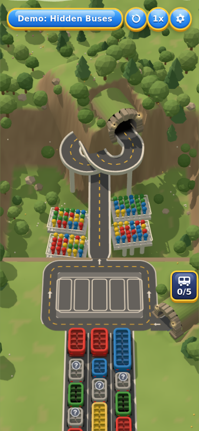 | 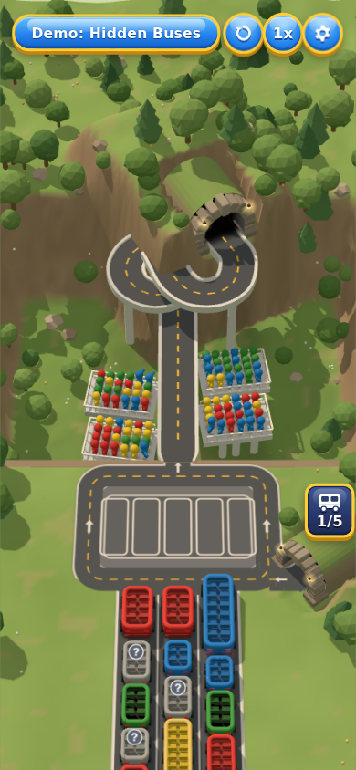 |
| connected buses | 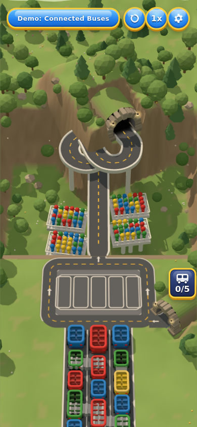 | 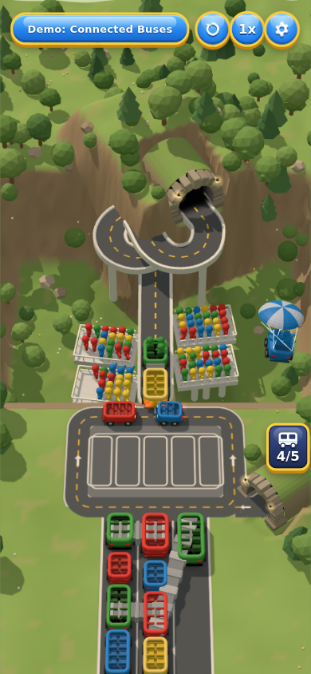 |
| colourful tunnel | 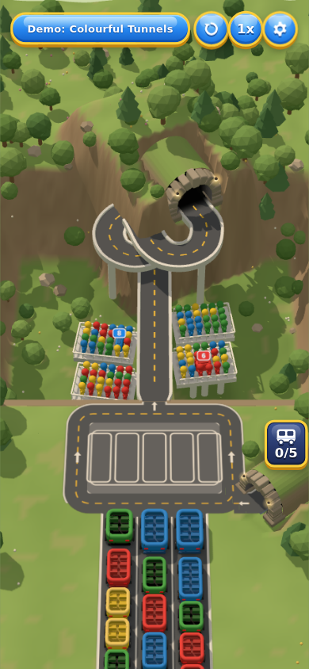 | 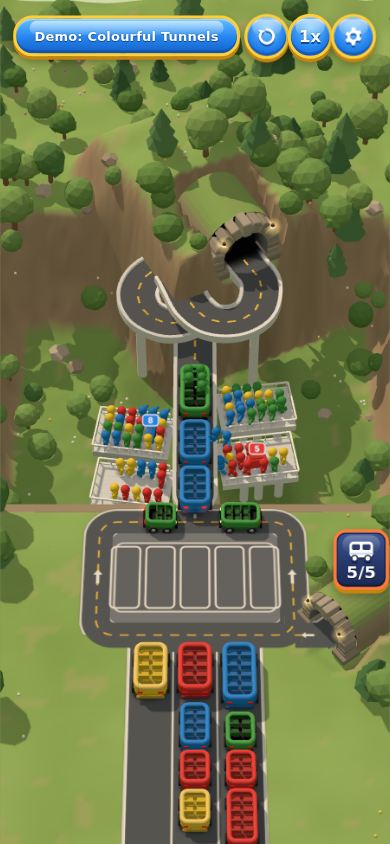 |
| hidden stickmen | 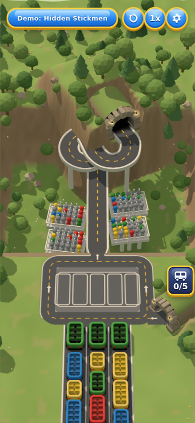 | 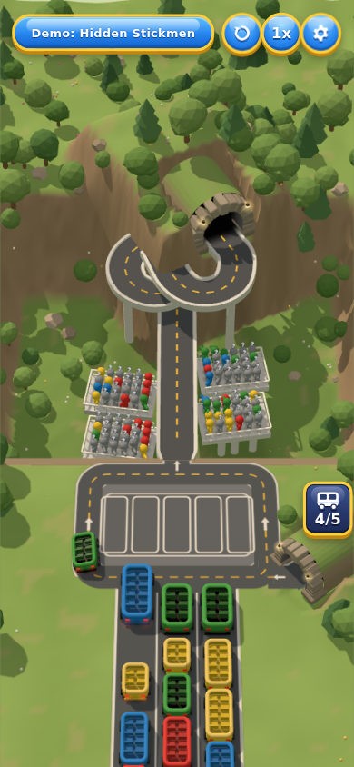 |
| lock & key | 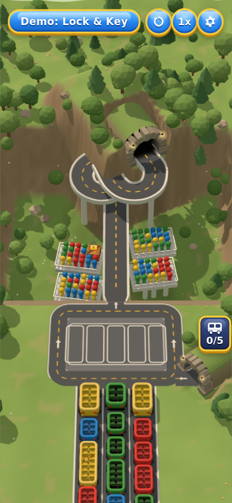 | 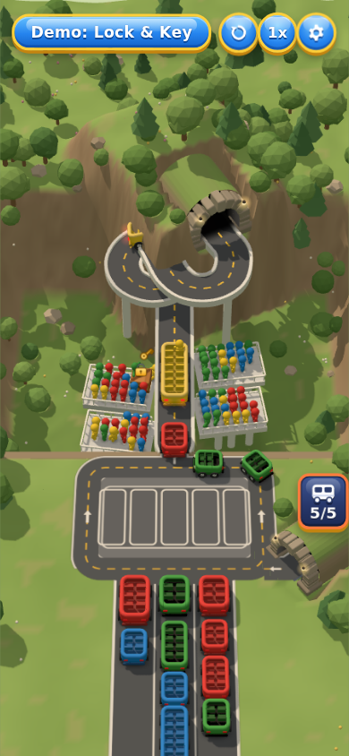 |
| count box | 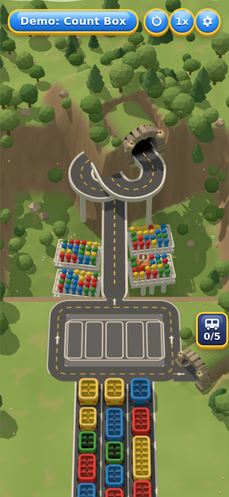 | 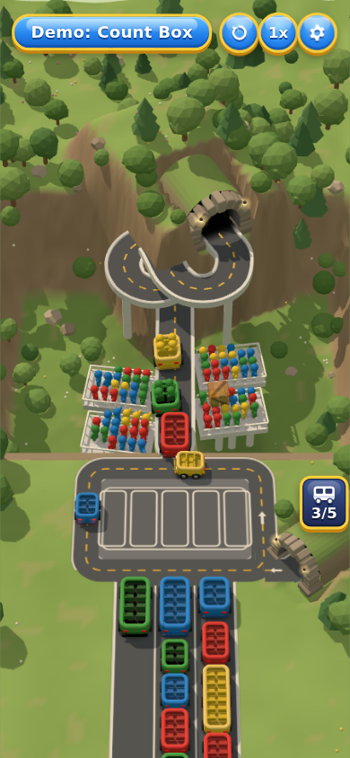 |
| all together | 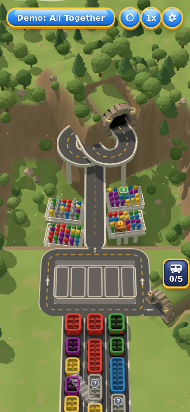 | 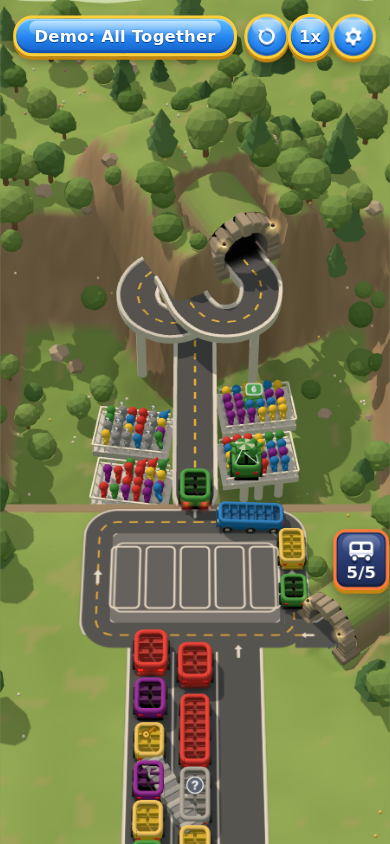 |

`node tools/export-demo-pack.js` makes the demo pack through the editor's own UI. It types
the seven demo ids into the Level Order panel
([screenshot](screenshots/editor-level-order.png)), then clicks *Export order JSON* and
*Playable HTML*:
- `levels/demo-level-order.json` is the order;
- `dist/match-express-blocker-demos.html` is the pack (committed, like the other single
  files).

The tool then opens the pack from `file://` at 390×844 and lets the greedy bot play it.
It wins all seven levels in order and ends on the *All levels complete* screen, with no
network request. Screenshots:
- [level 1 of 7](screenshots/pack-level-1.png);
- [a win offering the next level](screenshots/pack-level-complete.png);
- [the end](screenshots/pack-all-complete.png).

## The 40-level funnel

Forty levels for a first-session funnel, built from a design table (role, target difficulty 1–10, queue
lanes, ramps, colours, stickmen, bus sizes, blockers, road and ramp idea per level):
- `levels/funnel/f01.json` … `f40.json`, the order `levels/funnel/funnel-order.json`, and the measured data
  `funnel-report.json` (tuning) and `funnel-bots.json` (the bot table);
- **`dist/match-express-funnel-40.html`**: all 40 levels in one file (double-click, no server, no network);
- **`dist/funnel.xlsx`**: the funnel sheet, the curves and a summary (opens in Google Sheets).

Download: [match-express-funnel-40.html](https://github.com/bhanyagici/Prototype1/raw/claude/sweet-einstein-si64t3/match-express/dist/match-express-funnel-40.html) ·
[funnel.xlsx](https://github.com/bhanyagici/Prototype1/raw/claude/sweet-einstein-si64t3/match-express/dist/funnel.xlsx) ·
[funnel-order.json](https://github.com/bhanyagici/Prototype1/raw/claude/sweet-einstein-si64t3/match-express/levels/funnel/funnel-order.json)

```
node tools/make-funnel.js                 # roads, ramps, content, tuning -> levels/funnel (about 8 minutes on 4 cores)
FUNNEL_PASS=2 node tools/make-funnel.js --refine   # more candidates per level (passes 1 and 2 were run)
node tools/make-funnel.js --search 6 8 16 # the lane retune: saved roads and ramps kept, content made again
FUNNEL_PASS=2 node tools/make-funnel.js --search 6 8   # another pass; the saved level stays unless beaten
node tools/make-funnel.js --measure 7 11  # saved levels unchanged, measured again (meta from the design table)
node tools/funnel-bots.js                 # the bot table -> levels/funnel/funnel-bots.json
python3 tools/make-funnel-xlsx.py         # -> dist/funnel.xlsx (then recalculate, e.g. LibreOffice)
node tools/build-funnel.js                # -> dist/match-express-funnel-40.html
node tools/shoot-funnel.js                # -> screenshots/funnel/
```

### How a level is made

- **Road** (`tools/funnel/geometry.js`): a turtle program per level: straights, turns on a minimum
  radius, spirals (`S`); heights climb gently and rise over each spiral's crossing.
- **Ramps**: a shape per ramp: straight out, diagonal, curved arc, L, fan (columns spreading toward the back)
  or wedge (drawing together). Two new ramp fields in the core: `spread` (fan / wedge) and `push` (a turned
  ramp's front edge kept clear of the road). A solver finds a spot along the road inside the target zone,
  clear of the road, the exit, spirals and the other ramps (real outlines, a new `ramp-fold` check for bent
  ramps and a `ramp-exit` check for the tunnel mouth).
- **Content** (`tools/funnel/content.js`): the buses, an intended send order (the plan), then the columns
  filled front-to-back following the plan, so the plan always works; the lanes are dealt from the plan. One
  knob, hardness `h`, sets how forgiving the level is for out-of-order play: same-colour run lengths, how far
  the lanes drift from the plan, and "trap" buses (colours still buried at the start) at the lane heads.
  Tunnels, lock boxes, connected groups and hidden buses are placed against the plan.
- **Tuning** (`tools/make-funnel.js`): only the stickmen order in the columns, the bus order and sizes in the
  lanes and the blocker placement change. Bisection on `h`, then two refine passes of more (h, seed)
  candidates; the greedy bot must win and no cheering prediction may miss. Among in-band candidates the longer
  greedy game wins (playtime).
- **Queue lanes**: 2 lanes on 1–5, 9, 22 and 31; 4 on 16, 20, 23 and 35; 5 on 38 and 40; 3 on all others
  (25–30 always 3). The 4- and 5-lane levels carry 6–14 connected groups, most of them across neighbouring
  lanes. The lane retune (`--search`) kept every level's road and ramps and made only the content again:
  many (h, seed, group count) candidates with a quick 50-game estimate, the nearest few checked with 200.
- **Levels 1–5 cannot be lost**: enough colours sit in whole columns of their own that at most 5 buses could
  ever come back unfilled; each was played 1000 times by the random bot and by an adversarial bot without a loss.

### Ramp changes (did not fit the target zone at the fixed camera)

The stickmen counts stayed; these ramps changed proportion or shape:
- level 18, ramp 3: the L shape did not fit, built as a diagonal;
- level 35, ramp 1: 10x6 did not fit, built as 12x5 (60 cells, as before);
- level 40, ramp 3: straight did not fit, built as a diagonal;
- level 40, ramp 6: 8x6 did not fit, built as 4x12 (48 cells, as before).

### Difficulty, measured

Random-bot win rate over 200 games (the target bands: 1–2 ≥ 70%, 3: 55–75%, 4: 45–60%, 5: 35–50%,
6: 25–40%, 7: 18–30%, 8: 12–22%, 9: 8–15%). Challenge, Milestone, Finale and Practice levels must land in
their band; Relax, Fun and Teach levels may be easier. Measured diff places the win rate on the same scale
(band centres, a straight line between them). The greedy bot wins all 40; levels 1–5 cannot be lost.

| Lv | Role | Lanes | Target diff | Band | Random wins / fails / unfinished | Win rate | Measured diff | In band | Greedy 1x | Greedy 2x |
|---|---|---|---|---|---|---|---|---|---|---|
| 1 | Tutorial | 2 | 1 | ≥ 70% | 200 / 0 / 0 | 100.0% | 1.0 | yes | 13.5 s | 6.8 s |
| 2 | Teach | 2 | 2 | ≥ 70% | 200 / 0 / 0 | 100.0% | 1.0 | yes | 17.9 s | 8.9 s |
| 3 | Tutorial (bay re-send) | 2 | 2 | ≥ 70% | 200 / 0 / 0 | 100.0% | 1.0 | yes | 40.7 s | 20.4 s |
| 4 | Teach (bus sizes) | 2 | 3 | 55–75% | 200 / 0 / 0 | 100.0% | 1.0 | easier (allowed) | 34.2 s | 17.1 s |
| 5 | Fun | 2 | 2 | ≥ 70% | 200 / 0 / 0 | 100.0% | 1.0 | yes | 33.9 s | 16.9 s |
| 6 | Challenge | 3 | 5 | 35–50% | 197 / 3 / 0 | 98.5% | 1.1 | **no** | 72.0 s | 36.0 s |
| 7 | Teach + POPUP | 3 | 3 | 55–75% | 200 / 0 / 0 | 100.0% | 1.0 | easier (allowed) | 72.4 s | 36.2 s |
| 8 | Practice | 3 | 5 | 35–50% | 181 / 19 / 0 | 90.5% | 1.6 | **no** | 40.7 s | 20.4 s |
| 9 | Relax | 2 | 3 | 55–75% | 200 / 0 / 0 | 100.0% | 1.0 | easier (allowed) | 65.8 s | 32.9 s |
| 10 | Milestone | 3 | 6 | 25–40% | 120 / 80 / 0 | 60.0% | 3.4 | **no** | 90.1 s | 45.0 s |
| 11 | Relax | 3 | 3 | 55–75% | 146 / 54 / 0 | 73.0% | 2.6 | yes | 76.7 s | 38.4 s |
| 12 | Challenge | 3 | 6 | 25–40% | 123 / 77 / 0 | 61.5% | 3.3 | **no** | 77.3 s | 38.6 s |
| 13 | Teach + POPUP | 3 | 3 | 55–75% | 128 / 20 / 52 | 64.0% | 3.1 | yes | 135.9 s | 68.0 s |
| 14 | Practice | 3 | 6 | 25–40% | 75 / 125 / 0 | 37.5% | 5.5 | yes | 112.6 s | 56.3 s |
| 15 | Fun | 3 | 3 | 55–75% | 200 / 0 / 0 | 100.0% | 1.0 | easier (allowed) | 53.0 s | 26.5 s |
| 16 | Challenge | 4 | 7 | 18–30% | 44 / 156 / 0 | 22.0% | 7.3 | yes | 132.2 s | 66.1 s |
| 17 | Teach (no popup, short hint) | 3 | 4 | 45–60% | 93 / 7 / 100 | 46.5% | 4.6 | yes | 130.7 s | 65.3 s |
| 18 | Relax | 3 | 3 | 55–75% | 200 / 0 / 0 | 100.0% | 1.0 | easier (allowed) | 73.1 s | 36.5 s |
| 19 | Practice | 3 | 6 | 25–40% | 68 / 132 / 0 | 34.0% | 5.8 | yes | 178.1 s | 89.0 s |
| 20 | Milestone | 4 | 8 | 12–22% | 37 / 163 / 0 | 18.5% | 7.8 | yes | 191.5 s | 95.8 s |
| 21 | Teach (combo, no popup) | 3 | 5 | 35–50% | 80 / 94 / 26 | 40.0% | 5.3 | yes | 122.2 s | 61.1 s |
| 22 | Relax | 2 | 3 | 55–75% | 200 / 0 / 0 | 100.0% | 1.0 | easier (allowed) | 72.0 s | 36.0 s |
| 23 | Challenge | 4 | 7 | 18–30% | 45 / 155 / 0 | 22.5% | 7.2 | yes | 128.2 s | 64.1 s |
| 24 | Fun | 3 | 4 | 45–60% | 200 / 0 / 0 | 100.0% | 1.0 | easier (allowed) | 105.6 s | 52.8 s |
| 25 | Challenge | 3 | 8 | 12–22% | 41 / 0 / 159 | 20.5% | 7.5 | yes | 169.5 s | 84.8 s |
| 26 | Teach + POPUP | 3 | 3 | 55–75% | 140 / 60 / 0 | 70.0% | 2.8 | yes | 115.7 s | 57.9 s |
| 27 | Practice | 3 | 6 | 25–40% | 121 / 79 / 0 | 60.5% | 3.4 | **no** | 110.2 s | 55.1 s |
| 28 | Relax | 3 | 3 | 55–75% | 173 / 27 / 0 | 86.5% | 1.9 | easier (allowed) | 65.5 s | 32.8 s |
| 29 | Challenge | 3 | 7 | 18–30% | 59 / 31 / 110 | 29.5% | 6.4 | yes | 131.4 s | 65.7 s |
| 30 | Milestone | 3 | 9 | 8–15% | 30 / 59 / 111 | 15.0% | 8.4 | yes | 176.4 s | 88.2 s |
| 31 | Relax | 2 | 3 | 55–75% | 200 / 0 / 0 | 100.0% | 1.0 | easier (allowed) | 73.2 s | 36.6 s |
| 32 | Teach + POPUP | 3 | 4 | 45–60% | 91 / 109 / 0 | 45.5% | 4.7 | yes | 134.8 s | 67.4 s |
| 33 | Practice | 3 | 6 | 25–40% | 68 / 132 / 0 | 34.0% | 5.8 | yes | 147.7 s | 73.8 s |
| 34 | Fun | 3 | 4 | 45–60% | 176 / 24 / 0 | 88.0% | 1.8 | easier (allowed) | 119.5 s | 59.8 s |
| 35 | Challenge | 4 | 8 | 12–22% | 34 / 166 / 0 | 17.0% | 8.0 | yes | 200.2 s | 100.1 s |
| 36 | Relax | 3 | 4 | 45–60% | 104 / 96 / 0 | 52.0% | 4.0 | yes | 105.0 s | 52.5 s |
| 37 | Practice | 3 | 7 | 18–30% | 56 / 144 / 0 | 28.0% | 6.5 | yes | 198.8 s | 99.4 s |
| 38 | Challenge | 5 | 8 | 12–22% | 36 / 155 / 9 | 18.0% | 7.9 | yes | 195.3 s | 97.7 s |
| 39 | Fun | 3 | 5 | 35–50% | 133 / 67 / 0 | 66.5% | 2.9 | easier (allowed) | 114.8 s | 57.4 s |
| 40 | Finale | 5 | 9 | 8–15% | 17 / 105 / 78 | 8.5% | 9.3 | yes | 235.6 s | 117.8 s |
| | **Total** | | | | | | | **24 / 40** (must-land: 13 / 18) | **72.7 min** | **36.4 min** |

**Out of band, closest version kept (5 levels).** The tuning may only change the stickmen order in the
columns, the bus order and sizes in the lanes and the blocker placement; three search passes (about 640
candidates each, the best checked over 200 games) got these as close as they go:
- **6 (98.5%), 8 (90.5%), 10 (60.0%), 12 (61.5%), 27 (60.5%)**: small or medium 3-lane levels without
  connected buses. Under the current rules (5 on the road, 5 bays, unlimited re-sends) the random bot only
  loses when 6 unfilled buses are out at once; a bus sent out of order still takes whatever stickmen of its
  colour are open, and parked buses are re-sent as often as lane buses, so the bays drain. Connected groups
  are what make a level hard (a returning group needs a free bay for every member), and these levels have
  none in their design row.
- **Level 4** (band 55–75%) is fail-free by the rule "no fail before level 6", so it is at 100% (allowed:
  a Teach level may be easier).

**Unfinished games.** On the levels with connected groups many random games end without a result
(the "unfinished" column): the bot keeps re-sending half-full buses, so the road never has room for a
connected pair or triple. That is not a dead end for a player, who can wait for the road to clear (the
core's no-deadlock rule holds); under the agreed metric it counts as "not won". Wins / fails /
unfinished are listed separately here and in the spreadsheet. On level 20, for example, the random bot
never fails and 158 of 200 games stay unfinished, so a person will find it easier than its 21% suggests.

**Rendering fix found while shooting.** On the 7 levels whose road ends heading down toward the yard (7, 11,
17, 25, 28, 35, 36), the exit tunnel's hill covered the bays; the hill now stops short of the yard plateau,
and the tunnel's roof shell has a closed rock end.

### Tutorials, popups and the hint

They come from each level's `meta` (`tutorial`, `tutorialLane`, `popup`, `hint`), which the core now keeps
through `normalizeLevel` (and so the editor keeps it too):
- **Level 1**: a hand pointer and a short tip. Tap the bus whose colour matches the front row → watch the
  stickmen board → a full bus leaves with a parachute → the next bus. While the hand shows (and while the
  stickmen board), taps on other buses do nothing.
- **Level 3**: built so the first bus (the hand's) can reach only half of its stickmen: it comes back and parks.
  Once its colour is at a front again (and the road has room), the hand points at the parked bus: parked
  buses can be sent back.
- **Intro popups** on the first appearance of a blocker: level 7 Hidden Bus, 13 Connected Buses, 26 Colorful
  Tunnel, 32 Lock & Key. Title, one sentence, a small looping picture and OK; the game waits behind it. Seen
  popups are remembered (`localStorage`, key `me-intro-seen`). Combination levels have none.
- **Level 17**: a short hint about triple connected buses, for 5.5 s, that does not stop the game.

### The 40-level file

`window.ME_SHARE` turns on two extras for this pack (other packs are unchanged):
- **nav**: Previous and Next buttons around a "Level x / 40" title pill; a won level moves on to the next
  one by itself after a 3.5 s countdown on its Next button (Replay stops it).
- **stats**: per level the completion time (game seconds of the first win, so 2x does not halve it), the fail
  count and the second of each fail, saved in `localStorage` (`me-stats:funnel-40`). The Stats panel lists
  all 40 levels; *Export CSV* saves `match-express-stats.csv`
  (`level,id,name,completion_s,fails,fail_seconds,wins`); *Reset stats* asks for a second tap. The bot's games
  (B key) are not counted.

| | | |
|---|---|---|
| level 1 (tutorial) | level 7 | level 13 |
| 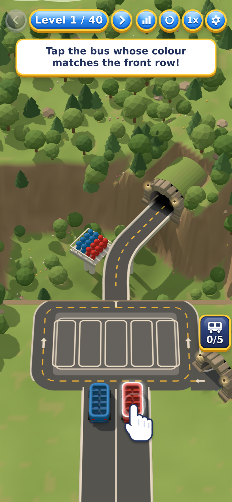 | 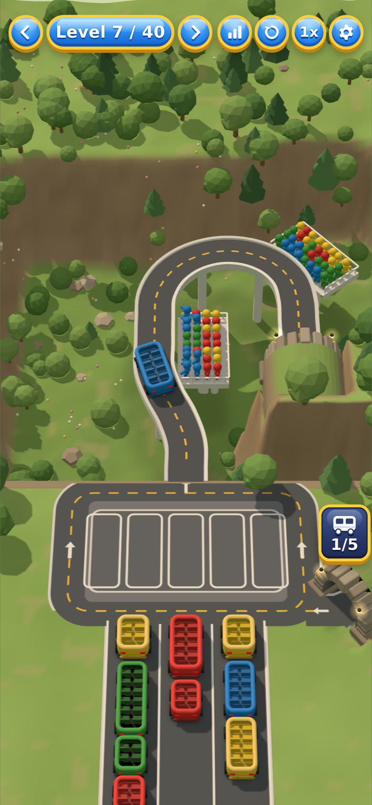 | 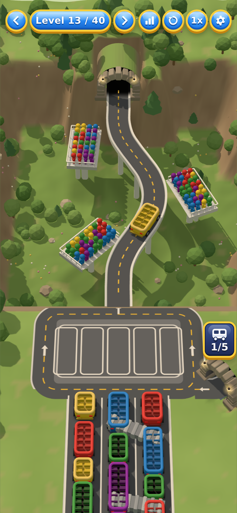 |
| level 15 | level 20 | level 26 |
| 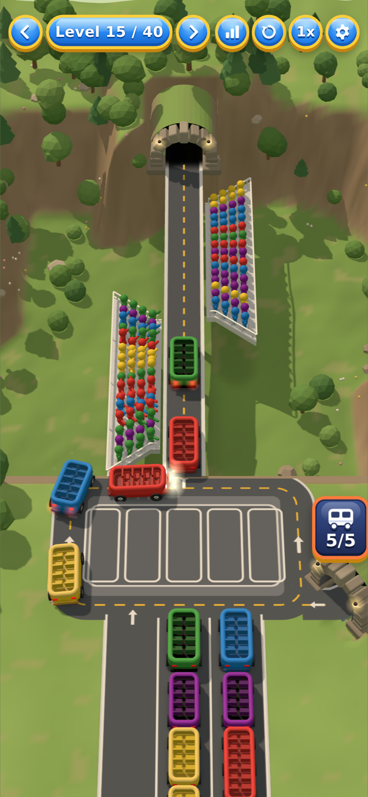 | 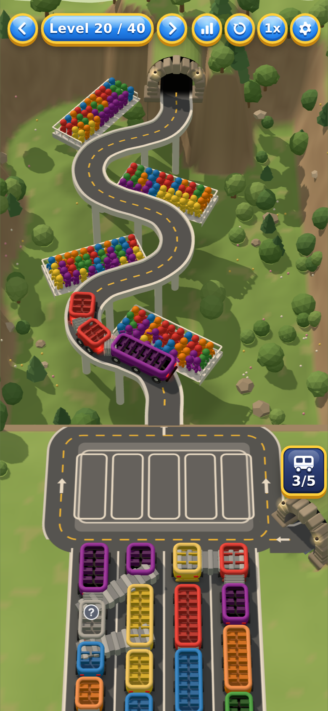 | 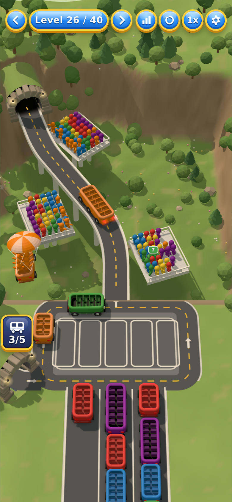 |
| level 30 | level 32 | level 40 |
| 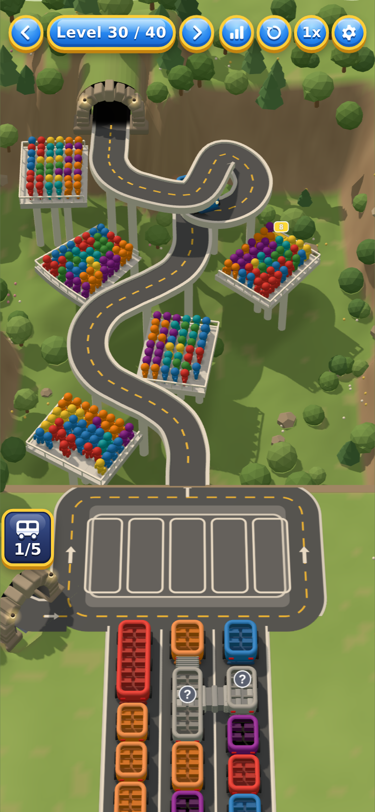 | 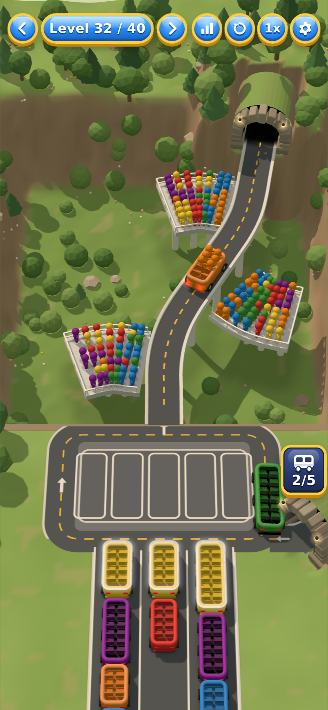 | 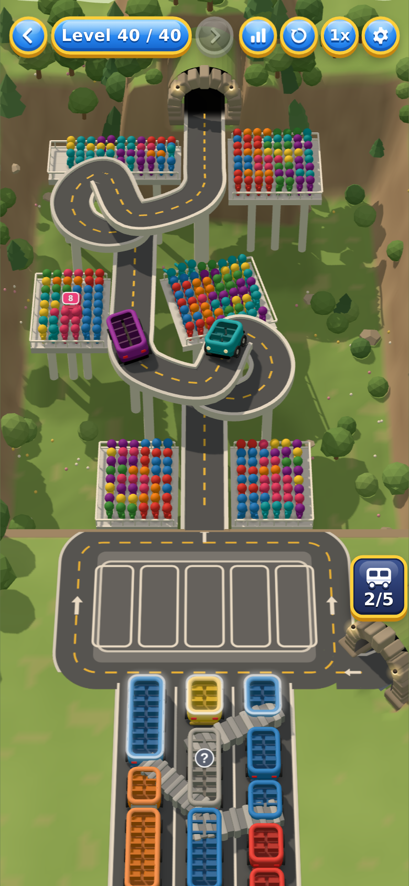 |
| the Hidden Bus popup | the Stats panel | |
| 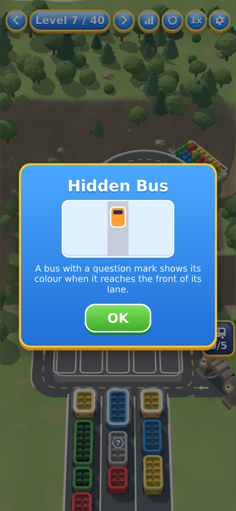 | 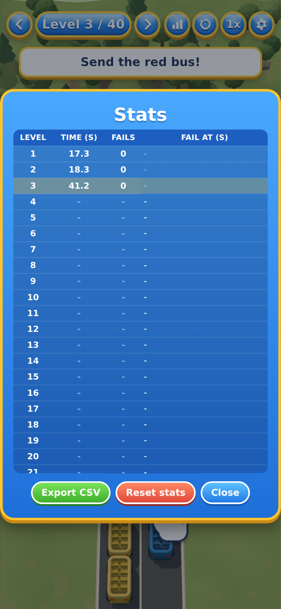 | |
| 2 lanes (level 9) | 4 lanes (level 35) | 5 lanes (level 38) |
| 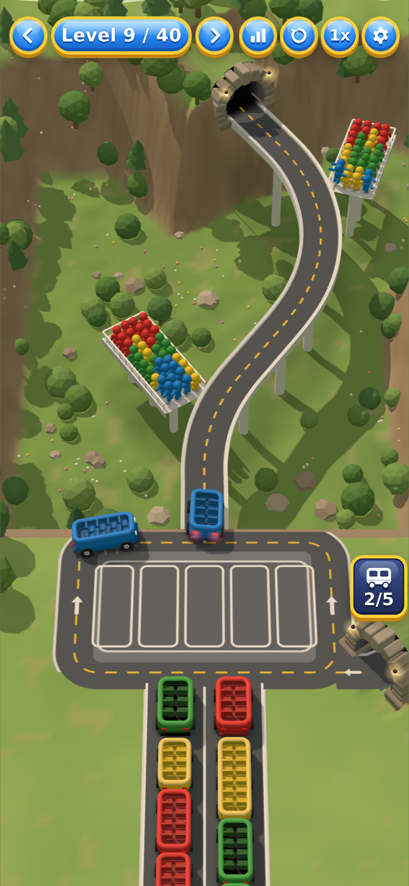 | 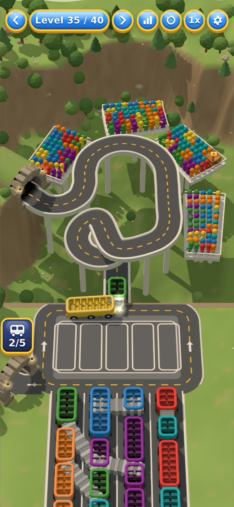 | 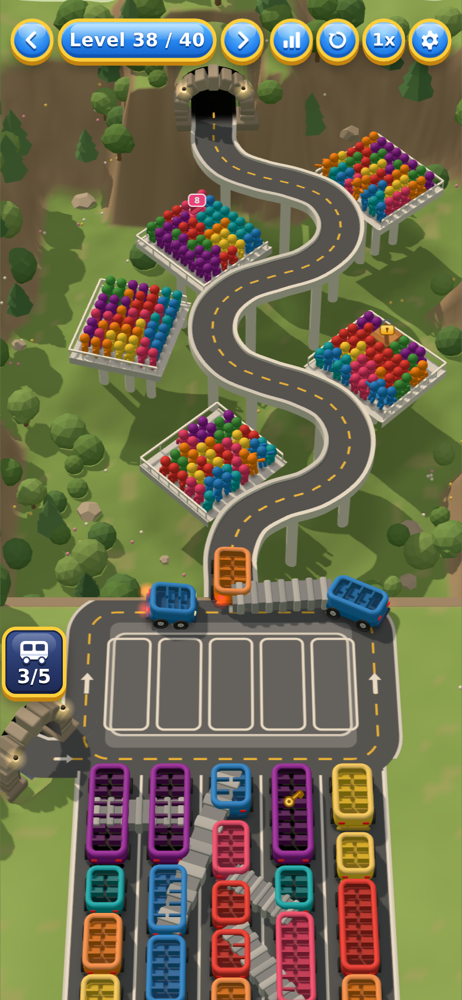 |

## Speed, sound, animation

- **1x / 2x** (top right, next to settings) sets one global time scale for the
  simulation, the animations, the particles and the timers. "2x" is highlighted when
  it is on. Sounds keep their pitch. The headless bots and the tests always run at
  1x.
- **Sound** is synthesised with WebAudio:
  - pops rise in pitch along a boarding chain and reset after it;
  - each bus has an engine hum that follows its speed;
  - also: a soft brake squeak, a horn when a bus fills, a whoosh when the parachute
    opens, an echo in the tunnel and a soft warning thud;
  - a forest ambience of wind and birds plays underneath;
  - every sound is layered and its pitch varies a little.

  Settings → *Sound* mutes it, and the choice is remembered.
- **Buses** are chunky toy buses, one colour each, with lighter and darker trims of
  that colour:
  - a rounded boxy body with a darker lower band and a thick rounded rim around the
    open top;
  - small round headlights and a rounded bumper at the front, red tail lights at the
    back;
  - fat dark wheels that peek out at the sides;
  - inside, the floor, seats and inner walls are in a darker shade.

  The body is one profile swept around a rounded rectangle. The front and back caps
  stay the same size, and only the middle stretches with capacity.
- **Stickmen** are chunky toy figures with no face:
  - a big round head (40% of their 0.78 height) and a short rounded body;
  - thick rounded arms and legs, as three instanced meshes (bodies, arms, legs).

  They swing their arms and legs when they run. Seated in a bus, only the head and
  shoulders show above the seat back.
- **Tunnels** (top exit and return) are built the same way:
  - a stone arch of chunky blocks on a thick base, with two warm lamps that pulse
    when a bus passes;
  - a dark interior that fades to black, with the road running into it;
  - a grassy roof mound behind the arch.

  The arch is aligned with the road direction at the mouth. A bus fades into the dark
  front first and comes out rear last. The darkening is per pixel, behind the
  mouth: a shader patch on the road, bus, wheel and stickman materials. A bus is
  fully dark by the time the core hides it, so it never pops.
- **Animation:** nothing snaps.
  - Buses ease in and out, and sit on spring suspension.
  - They lean in curves, their wheels turn, and they pitch forward on hard brakes.
    A hard stop kicks up a little dust.
  - The queue rolls forward smoothly.
  - **Cheering starts the moment a bus is sent** (from the queue or a bay). The core
    works out exactly which stickmen that bus will take on this lap, over all ramps,
    and only they cheer. They hop with their arms up in a V, each starting a moment
    after the last, and keep cheering until they board. Everyone else stays calm.
  - Columns step forward in a staggered wave. Idle stickmen breathe, sway and look
    around, each a little differently.
  - **A full bus first drives straight sideways**, perpendicular to the road, off
    the edge on the side away from its ramp, with a dust puff. Only when it is
    completely off the road does it crouch and hop. Under the elevated U-turn
    (ramp 5) it slides further, until no road is overhead. The parachute in its colour
    unfolds with an overshoot, and the bus swings like a pendulum while drifting
    down and away, its passengers waving with both arms.
  - The ramp check badge pops with an overshoot and a sparkle.
  - A crash plays in slow motion, then the dominoes fall and the stickmen tumble.
  - Buttons and panels spring.
- **Shading:**
  - soft contact shadows under every bus and every standing stickman;
  - ambient-occlusion darkening baked into the ground under the road and the ramps.
- **The UI** uses chunky, glossy candy controls (level pill, buttons, counter sign),
  each with a thick gold rim, a deep bottom edge and a gloss highlight.

## Playing

**Sending.** Every tap on the front bus of a queue lane sends it to the main road
(collector road, nearer side lane, entry road). A queue bus never goes to a static
bay. The road holds at most 5 buses: at 5/5 a queue tap is refused, so the bus shakes
and nothing else happens (not a fail). A bus parked in a bay can be tapped to send it
back to the road when the counter is below 5; at 5/5 it does a handbrake lurch.

**The road counter** (the sign on the right):
- +1 the moment a bus is sent to the road, from the queue or from a bay;
- -1 when a full bus jumps off the road;
- a bus that finishes its lap unfilled keeps counting through the tunnel and on its
  way back, and is subtracted only once it has parked in a static bay.

**Static bays** are only for buses that come back from a lap unfilled.

On the main road a bus stops at a ramp only if a front-row stickman matches its
colour. Matching front-row stickmen board nearest-the-road first, the columns step
forward, and the new front row is checked again until the bus is full or nothing
matches. A full bus honks, drives sideways off the road edge, then hops and
parachutes away. An unfilled bus goes through the top tunnel, comes out of the
return tunnel `RETURN_TUNNEL_TIME` later
and parks in the leftmost free bay with its passengers. If every bay is taken when
it comes out, it crashes into the parked row (dominoes) and the level is lost.
Sending a parked bus back to the road in time frees its bay.

**Cheering.** The moment a bus is sent, the core replays the boarding rules forward
from the current state (`C.lapBoarders`). The buses already on the road, and those
heading to it ahead of this one, board first. Buses never overtake, so the replay is
exact. Only the stickmen it gives this bus cheer: never more than its free seats,
never one already promised to a bus ahead, and hidden ones too, which stay hidden
until they reach the front row. If a bus ever passed a predicted stickman without
taking him, his cheering would stop and the game would log a `[cheer]` warning; the
tests check that this never happens.

Keys: **D** debug (front rows, boarding points, road-capacity maths), **B** greedy bot
plays live, **R** restart.

## Tuning

At the top of `shared/core.js`: `BUS_SPEED`, `BOARD_RATE`, `COLUMN_SHIFT_TIME`,
`ROAD_CAPACITY` (5), `STATIC_SLOTS` (5), `PARACHUTE_DURATION`, `RETURN_TUNNEL_TIME`,
`WIN_PANEL_DELAY` (1 s).

## Level data and the generator

`LEVEL_DATA` in `shared/core.js` is the built-in level, in format 2 (see above):
5 ramps of 4 columns and 3 lanes. The game never runs the generator. The editor is
now the usual way to make a level.

The built-in level has the stickmen and buses `generateLevel(11)` produced. Only its
road and ramp placement are the hand-made compact layout. Ramp 3's columns are back
in the generator's order, which the compact road boards in the original priority. The generator still works: run this in the
console and import the result into the editor, or paste it over `LEVEL_DATA`:

```js
MECore.searchSeed(1, 400, console.log).level
```

`generateLevel(seed)` gives 24 stickmen per colour on ramps of 40/36/40/36/40, with
runs of 1–4 in every column, at least 6 colours per ramp, at least 5 colours across
the front rows, the fixed bus plan in lanes of 9/9/8, and 2 hidden buses outside
the first two places. `searchSeed` keeps the first seed where the greedy bot wins
(at both the 1/30 s headless step and the 1/60 s live step) and the random bot wins
15–45% of 200 runs.

On startup the page re-validates `LEVEL_DATA` and logs seats against stickmen per
colour. A Web Worker then replays both bots on the frozen level:

```
[level] seed 11 — the game loads the frozen LEVEL_DATA
[level] seats vs stickmen per colour: red 24/24 ... pink 24/24 -> ALL MATCH
[sim] greedy bot: WIN — 51 sends, 192/192 boarded, 188.4 s of game time
[sim] greedy moves: L0:red4>road L0:pink12>road L0:orange6>road ...
[sim] random bot: 35/200 wins (17.5%) — difficulty Medium
```

**Bots.** Both bots only ever send buses to the main road, as the rules now require:
the front bus of a queue lane, or a parked bus sent back, and only while the counter
is below 5. They never parked a queue bus even under the old rule, so their results
did not change. The **greedy bot** sends the available bus whose colour
has the most stickmen in the front rows. It waits while that score is 0 and traffic
is still moving. On a tie at 0 it takes a lane front, to dig into the queue; on a
positive tie it takes a parked bus, to free a bay. Without that tie-break it could
cycle the same parked buses forever. The **random bot** picks uniformly among the
available buses.

## How a few pieces work

**Yard traffic** never collides or deadlocks. When a bus is sent, its route is
rasterised once into the grid cells its footprint sweeps (0.3-unit cells with a
0.1 margin). Each cell stores when the bus enters it and when it leaves. A later
trip may not enter a cell that an earlier trip still has to cross. Waiting only ever
points at earlier trips, so there can be no cycle, and with merge order equal to
send order the buses also join the main road in the order they were sent. Each
check is O(1) per pair of trips per step.

**Main road.** Catmull-Rom (the same centripetal formulation as
`THREE.CatmullRomCurve3`) through the control points, with one loop. The loop
crosses its own entry 1.25 units higher, on white pillars. Buses keep a fixed bumper
gap, so a stop for boarding cascades into hard brakes behind it, with brake lights.

**Ramps** hang 0.85 below the road deck (`RAMP_DROP` in the yard preset). Passengers
hop up into the bus. A full bus driving sideways off the road passes above the
neighbouring crowds, so it never cuts through anyone. The simulation never reads ramp
height.

**Rendering.**
- **Stickmen** are three instanced meshes: bodies (torso and head), arms (2 each) and
  legs (2 each). Their shadow map comes from a low-poly proxy that shares the body
  matrices, and a soft blob under each one is a fourth instanced mesh.
- **Buses:** each is one merged vertex-coloured mesh plus its light meshes and a
  contact-shadow quad. Wheels are one instanced mesh, tinted per bus in tunnels.
- **Tunnels** sit in a trench carved into the terrain heightfield, under a roof
  shell, so nothing blocks the view into the mouth.
- **The yard paint** is one canvas texture per yard preset.

## Verification

```
node tests/rules.test.js      # 37 rule checks: sending, counter, fail example, re-send, cheering
node tests/blockers.test.js   # 43 checks: every blocker, the checker rules for them, the demo levels (bots + cheering)
node tests/layout.test.js     # yard clearance sweep (both yard presets) + the drawn queue: >= 3 eight-seat buses per lane on 390 x 844
node tests/shared.test.js     # 74 checks: level format, layout builder, warnings (incl. the target zone), difficulty, links, bundled levels and level orders
node tests/browser.test.js    # 93 checks: game + editor in Chromium (needs `npm i playwright`)
node tests/standalone.test.js # 18 checks: builds dist/, opens the single files, an exported pack and both share files from file://, offline
node tests/funnel.test.js     # 41 checks: the 40 funnel levels against the design table, the bots (greedy wins all, playtime, levels 1-5
                              #   fail-free), two ramps on one spot, and the 40-level file from file:// at 390x844: tutorials, popups,
                              #   the hint, previous / next, auto-advance, stats + CSV + reset, 1x / 2x, the front bus outline and size
```

The first three need only Node and no dependencies; they load `shared/core.js`.
`browser.test.js` serves the folder itself. It takes these optional settings:
- `CHROMIUM=/path/to/chrome`;
- `THREE_MODULE=/path/to/three.module.js`, to serve three.js locally when offline;
- `HEADFUL=1`, to watch the run.

It ends by saving the editor screenshot.

**The rules did not change.** `tests/baseline.json` was recorded before the editor
work. The classic layout (`tests/fixtures/level2-classic.json` with
`"yard": "classic"`) still matches it bit for bit, through today's core: road length,
boarding points, the greedy bot's move list and times at 30 Hz and 60 Hz, and the
random bot's 31/200. Only geometry differs for the compact built-in level, and on it:
- the same stickmen and buses board in the same ramp order and the same column
  priority;
- the greedy bot wins at 30 Hz and 60 Hz (51 sends, 188.4 s);
- the random bot wins 35/200 (17.5%, Medium).

- The shared suite covers:
  - format 1 → 2 compatibility;
  - the tunnel side choice;
  - pillars and spirals;
  - ramp ordering and custom grids;
  - empty and hidden cells;
  - every warning kind;
  - the difficulty labels and `testLevel`;
  - linked buses.
- The browser suite covers:
  - the game's load order, 2x speed and mute;
  - RUN, Auto-run timing and new-tab sync;
  - undo/redo;
  - road insert, drag and delete, mouse and touch, and spirals;
  - painting, hidden cells, eraser and Fill random;
  - ramp resize and boarding drag;
  - queue add, link and reorder;
  - export/import and slots;
  - Test and Watch greedy;
  - proportions with the fixed camera: every stickman at least 16 px and the 8-seat
    bus in a bay at least 35 px, at 390 × 844;
  - the target zone: an out-of-zone road is listed, and a point added outside the
    frame lands inside it;
  - real taps: each queue tap counts on the sign at once (1/5 … 5/5); at 5/5 the bus
    shakes and stays;
  - cheering: from the moment a bus is sent, exactly the stickmen it will take cheer,
    already while it is in the yard, and exactly those then board it;
  - the full-bus exit: it moves perpendicular to the road (drift along it 0.000), on
    the side away from its ramp, without lifting. The hop starts only after the bus
    is clear of the road (clear at 1.23, hop at 1.41). A bus filled under the
    overpass hops with no road above it.

- Headless rule suite (37 checks), all passing:
  - queue taps only ever go to the road; 5/5 refuses a queue tap (shake, no fail);
  - the counter math, including an invariant checked at every step of 120 bot games;
  - the fail example, both versions: send 5, 2 return (3/5, bays 2/5), send 2 (5/5),
    3 return (bays 5/5, no fail), then the 4th to return fails, unless a parked bus
    was sent back first, in which case it takes the freed bay;
  - static re-send: a lurch at 5/5, back to the road (+1) below it;
  - cheering: 10 matching stickmen and an 8-seat bus give 8 cheering; 4 reachable give
    4; a hidden one who will board cheers; the next bus never takes stickmen promised
    to the one ahead. In every lap of 120 bot games the cheering set equals who boards;
  - merge order and no overtaking;
  - boarding order and chains, and the instant jump on the last seat;
  - tunnel timing, leftmost-bay parking and keeping passengers;
  - fail on tunnel exit, hidden reveal, and the greedy win at 60 Hz;
  - no yard overlap (separating-axis test) and no deadlock across 120 bot games.
- The layout check sweeps every yard route at the maximum bus length against parked
  and queued buses, for both presets. The minimum clearance is +0.027 for the
  compact yard and +0.030 for the classic one.
- In the browser, a live bot game:
  - wins in about 190 s of game time;
  - shows the Level Complete panel after the last parachute opens, plus
    `WIN_PANEL_DELAY`;
  - shows all 5 ramp check badges;
  - resets cleanly on Replay.
- A forced fail plays the crash, the dominoes and the Out of Space panel.

**Frame rate could not be measured here.** The sandbox has no GPU. What I could
measure:
- **132 draw calls, ~390k triangles per frame** at a busy moment, shadow pass
  included.
- 0.38 ms of CPU per 60 Hz logic tick, including the scene update.
- The canvas renders at native device resolution, capped at 2× DPR.

The 60 fps target is unverified on real hardware.

## Judgement calls

- **Environment.** The brief asks for a cozy forest on a grassy hill; the mockup is
  a red-rock canyon. I followed the brief, with muted greens so buses and stickmen
  stay the most saturated things on screen. I matched the mockup's layout, camera
  angle, UI and mood.
- **Return tunnel.** Its mouth faces left but is turned ~37° toward the camera. Fully
  side-on, the arch was invisible from this camera angle.
- **Level length.** The compact road makes the level shorter for the greedy bot:
  about 3 minutes, against 4. The random bot's 17.5% is inside the Medium band.
- **Compact layout versus a side exit.** Under the earlier closer camera (22 px
  stickmen and 70 px buses on a 390 px wide screen), the layout only fit if the ramps sit edge to edge along the road. That leaves no
  gap at the road side, so a full bus could not drive off without cutting through a
  neighbouring ramp. So the ramps hang 0.85 below the road deck: the bus drives off
  the edge above the neighbouring crowds, then hops. It always leaves on the side
  away from the ramp it boarded at.
- **How stickman height is measured** (formerly "at least 22 px", now about 17 px
  with the fixed camera). It is the on-screen silhouette of a standing
  stickman, from the feet to the top of the head. The figures are 0.78 tall on a
  0.36 grid, so crowds are packed head to head, as in the reference image.
- **Cheering** covers exactly the stickmen the bus will take on this lap, from the
  moment it is sent until they board. As asked, a hidden stickman who will board
  cheers too. It stays grey, but the cheer does hint at its colour.
- **The approaching-bus hop is gone.** The front-row bounce for any matching bus
  rolling up to a ramp would have made stickmen react who will not board, so only
  the cheering stickmen react now.
- **The classic preset** keeps the original layout playable and is the regression
  baseline for the rules. It uses the new bus and stickman models with its original
  camera.
