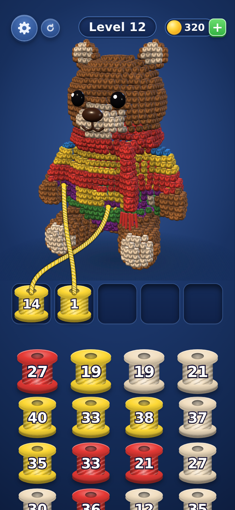

# Yarn Bear — playable prototype

Single self-contained file: **`yarn-bear/index.html`**. three.js 0.160.0 from a
pinned CDN via an import map; no other libraries, no build step. Open it in a
browser (it needs network access for the CDN import).

## Playing

Tap the front spool of any of the four columns and it drops into the leftmost
free slot. A spool in a slot pulls stitches of its own colour off the bear, one
at a time, always the visible matching stitch nearest the last one, so the
strand travels across the surface. Peeling a region reveals the colours
underneath. When a spool hits 0 it pops and frees its slot; with all five slots
full a tap just shakes the spool, which is not a fail.

The bear auto-rotates; drag it to spin it freely, and auto-rotation resumes
`AUTO_RESUME_DELAY` after you let go. A spool whose colour is not currently
facing you simply waits and resumes on its own once rotation or peeling exposes
one.

Keys: **D** highlight the visible voxels of the slot colours, **B** let the bot
play, **R** restart.

## Tuning

Constants at the top of the script: `AUTO_ROTATE_SPEED`, `AUTO_RESUME_DELAY`,
`PULL_RATE`, `VOXEL_RESOLUTION`, `SLOT_COUNT`, plus `VISIBILITY_MS` and the
spool split bounds.

## How a few pieces work

**The bear** is an amigurumi shape (big round head, cream-lined ears, wide
cream muzzle, plump sweater body, short arms, legs forward with cream foot pads,
a ribbed scarf with a long end down the front) built from ellipsoids, capsules
and a torus, voxelized at `VOXEL_RESOLUTION = 40` cells tall (8,073 voxels).
It is drawn as one compacted `InstancedMesh` of rounded stitches: only voxels
with an open face are uploaded (about 2,100 at the start), and the buffer is
patched as stitches are pulled. Each stitch gets a knitted-V colour + normal
canvas texture, a 5³-occupancy ambient-occlusion term, row-parity shading on
the sweater, ribbing on the scarf and a position smoothed toward its
neighbours' centroid so the silhouette reads rounder than the grid.

**Face and fringe** (glossy button eyes, nose, stitched mouth, scarf fringe) are
separate meshes, each tied to the voxels underneath it. When the last of those
is pulled the piece drops off, bounces on the floor and fades out.

**Look.** Warm key light from the upper left, cool rim light from behind, a soft
contact shadow and a navy radial-gradient background. Brown and cream are
rendered slightly warmer than their UI hex (`RENDER_HEX`); the gameplay colours
are unchanged. A pulled stitch lifts off the bear before disappearing, the
strand is a twisted rope drawn in the spool colour, and a winding spool spins
while its wound yarn visibly thickens.

**Layering.** A BFS from the surface gives every voxel a depth, the surface
colour is flooded inward, and each voxel takes that colour's layer sequence
shifted by depth. Patches are whole shells of a region, never scattered single
voxels, and all seven colours appear inside.

**Visibility** is not a raycast against triangles. Each voxel is visible when it
has an empty neighbour face pointing at the camera *and* a 3D-DDA walk of the
voxel grid from the voxel toward the camera reaches the outside without hitting
another live voxel. That is exact, costs 0.2ms for the whole model, and runs on
a `VISIBILITY_MS` throttle.



## Verification

On load the page logs the voxel counts, checks the spool split, and runs a
headless solvability bot that treats every exposed voxel as reachable, retrying
with a fresh seed up to 50 times:

```
[bear] voxels per colour: brown 2815  cream 1136  red 764  yellow 772  green 1139  blue 636  purple 811
[level] spool totals match voxel counts: YES   every spool within 5..40: YES   spools 318
[level] solvable: seed 1 passed, 318 sends
```

### Notes on two judgement calls

**Frame rate could not be measured here.** This sandbox has no GPU — Chromium
falls back to swiftshader and renders at a few frames per second, which is a
property of the test environment, not the game. What is measurable is the CPU
work per frame: **0.000ms** for pulling plus the end-state check, **0.30ms**
for the throttled visibility pass, and 0.12ms per pulled stitch including
re-shading its neighbours. The draw is a single instanced call of ~2,100
rounded stitches. The 60fps target is unverified on real hardware.

**Level length.** Raising `VOXEL_RESOLUTION` from 28 to 40 for a rounder bear
roughly tripled the voxel count, so a level is now 318 spools instead of 111.
Lower the constant to shorten it; generation and the solvability check adapt.

**`BAND = 1`.** Layer colours change every voxel of depth rather than every two.
The model is only ~5 voxels deep, so with wider bands the later entries of each
layer sequence were never reached and the queue came out roughly half brown. A
band is still a whole shell, so patches stay large.
